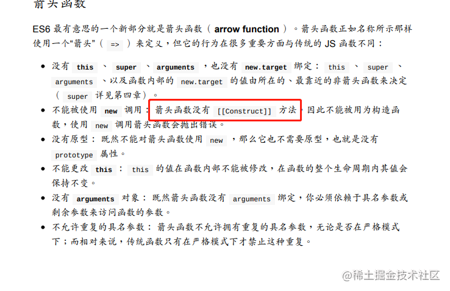
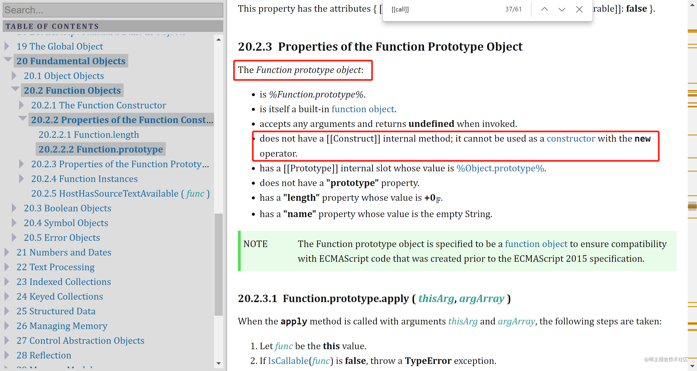
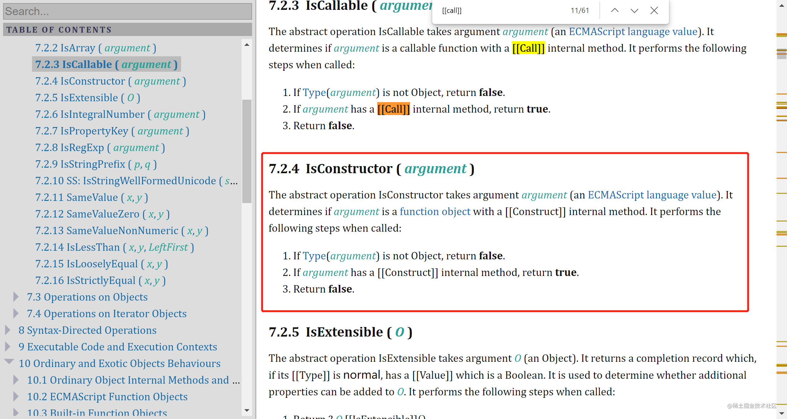
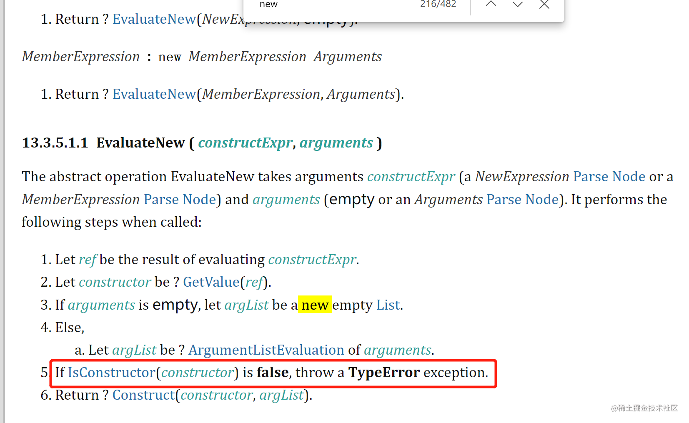

## 一句话答案

因为箭头函数没有`[[Construct]]`这个内部槽。

<!-- more -->

## 进一步解释

函数对象是一个支持`[[Call]]`、`[[Construct]]`内部方法的对象。每个支持[[Construct]]的对象必须支持[[Call]]，也就是说，每个构造函数必须是一个函数对象。因此，构造函数也可以被称为 *构造函数函数* 或 *构造函数对象*。  
所以，想要对某个对象使用 `new`，就得确保该对象具有`[[Construct]]`这个内部方法。而箭头函数没有`[[Construct]]`。

## 为什么没有`[[Construct]]`

因为箭头函数设计之初，就是为了设计一种更简短的函数并且不绑定 `this`。所以箭头函数不为参数 `super`、`this` 或 `new.target` 定义本地绑定。箭头函数中的 `this`、`super`、`arguments` 及 `new.target` 这些值由外围最近一层非箭头函数决定。

而这样的一个函数设计者认为没有必要委托给能够`[[Construct]]`的目标函数。所以箭头函数没有 `[[Construct]]`。  

同时因为没有构造原型的需求，所以箭头函数不存在 `prototype` 属性。

## 相关论据

> 以上为个人的一些见解，欢迎各位大佬拍砖
