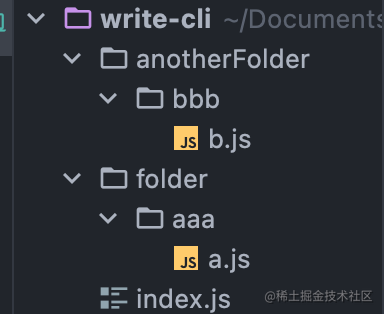

## 前言

`cli` 是在 `Node` 上开发的，因此我们需要掌握一些必要的前置知识。

本文内容主要对这些必要的前置知识进行讲解。

> **注意：以下所有示例均以 Macos 环境为例**

<!-- more -->

## path

该模块提供了一些用于处理文件路径的小工具，用于处理目录的对象，提高用户开发效率，让我们一起来快速的认识path对象的一些常用方法吧！

### path.relative()

该方法接受两个参数，这两个参数都应该是绝对路径。

该方法返回第二个路径相对于第一个路径的那个相对路径。

> `path.relative(from:string,to:string):string` \
>  如果 `from` 或 `to` 不是字符串，则抛出 `TypeError`

```js
import path from 'path'

console.log(path.relative('/write-cli/folder/aaa', '/write-cli/anotherFolder/bbb'))

//   ../../anotherFolder/bbb

```



上面代码中，如果当前目录是`'/write-cli/folder/aaa'`，进入`path.relative`返回的相对路径，就会到达`'/write-cli/anotherFolder/bbb'`。

如果`path.relative`方法的两个参数相同，则返回一个空字符串。

```js
console.log(path.relative('/write-cli/folder/aaa', '/write-cli/folder/aaa'))

// ''
```

### path.resolve

方法将相对路径解析为绝对路径。

它可以接受多个参数，依次表示所要进入的路径，直到将最后一个参数转为绝对路径。

> `path.resolve([...paths]:Arrary<string>):string` \
> 如果任何参数不是字符串，则抛出 `TypeError`

如果根据参数无法得到绝对路径，就以当前所在路径作为基准。除了根目录，该方法的返回值都不带尾部的斜杠。

```js
// 格式
path.resolve([from ...], to)

// 实例
console.log(path.resolve('folder/aaa', '/tmp/file/','..', 'a/../subfile'))

```

上述实例其实类似于做了如下操作

```shell
cd folder/aaa
cd /tmp/file/
cd ..
cd a/../subfile
```

更多栗子🌰🌰🌰

```js
path.resolve('/foo/bar', './baz');
// 返回: '/foo/bar/baz'

path.resolve('/foo/bar', '/tmp/file/');
// 返回: '/tmp/file'

path.resolve('wwwroot', 'static_files/png/', '../gif/image.gif');
// 如果当前工作目录是 /home/myself/node，
// 则返回 '/home/myself/node/wwwroot/static_files/gif/image.gif'
```

### path.join

该方法用于连接路径。

主要用途在于，会正确使用特定于平台的分隔符作为定界符将所有给定的 `path` 片段连接在一起，然后规范化生成的路径。

Linux/Macos 系统是 '/'，Windows系统是 '\'。

> `path.join([...path]:Array<string>):string` \
>  如果任何路径片段不是字符串，则抛出 `TypeError`

```js
path.join('/foo', 'bar', 'baz/asdf', 'quux', '..');
// 返回: '/foo/bar/baz/asdf'

path.join('foo', {}, 'bar');
// 抛出 'TypeError: Path must be a string. Received {}'
```

### path.parse

该方法可以返回路径各部分的信息。

```ts
path.parse(path:string):{
    dir:string,
    root:string,
    base:string,
    name:string,
    ext:string,
}
```

举个例子🌰

```
path.parse('/Users/joker/Documents/write-cli/folder/aaa/a.js')

{
  root: '/',
  dir: '/Users/joker/Documents/write-cli/folder/aaa',
  base: 'a.js',
  ext: '.js',
  name: 'a'
}
```


### path.extname

该方法可以返回对应的扩展名。

如果 `path` 的最后一部分中没有 `.`，或者除了 `path` 的基本名称的第一个字符之外没有 `.` 个字符，则返回空字符串。

> `path.extname(path:string):string`\
> 如果`path`不是字符串，则抛出 `TypeError`

举几个例子🌰

```js
path.extname('index.html');
// 返回: '.html'

path.extname('index.coffee.md');
// 返回: '.md'

path.extname('index.');
// 返回: '.'

path.extname('index');
// 返回: ''

path.extname('.index');
// 返回: ''

path.extname('.index.md');
// 返回: '.md'
```

### _dirname

总是指向被执行 js 文件的绝对路径。

所以当你在 `/write-cli/folder/aaa/a.js` 文件中写了 `__dirname`， 它的值就是 `/write-cli/folder/aaa/`

> 常跟 path 一起使用的的还有一个非常好用的库`slash`,这个将在后面的篇幅中介绍。

## process

`process`是`node`的全局模块,提供l有关当前 Node.js 进程的信息并可以对其进行控制。

### process.env

这个大家应该很熟悉了,`process.env`属性返回一个包含用户环境信息的对象。

在`process.env`中新增一个属性，会将属性值转换成字符串。

平时工作中我们用的比较多的一般是以下几种

```js
if(process.env.NODE_ENV === 'production'){
    console.log('生产环境');
}else{
    console.log('非生产环境');
}

const baseUrl = process.env.VUE_APP_BASE_URL
......
```

在 cli 的的开发中，我们也将在多处使用以上的用法。

### process.exit()

该方法可以用来立即退出进程。

如果程序出现异常，必须退出不可，那么我们可以约定一个`exitCode`用来作为异常退出的退出码，同时抛出一个未被捕获的error，来终止进程。

> `process.exit(exitCode=0:number)`


### process.exitCode

当进程正常退出或通过`process.exit()`退出而不指定代码时，`0`将作为进程的默认退出码。

如果有`process.exit(exitCode)`将覆盖 `process.exitCode` 的任何先前设置。

举个栗子🌰

```js
fun(){
  ......
  ......
}
// 0


fun(){
  ......
  process.exitCode = 1
  ......
  process.exitCode = 2
}
// 2

fun(){
  ......
  process.exitCode = 2
  ......
  exit(1)
}
// 1
```

### process.stdout

`process.stdout` 属性返回连接到 `stdout` (文件描述符 `1`) 的流。

例如，要将 `process.stdin` 复制到 `process.stdout`：

```js
import { stdin, stdout } from 'process';

stdin.pipe(stdout);
```


### process.cwd()

`process.cwd()` 方法返回 Node.js 进程的当前工作目录。

> `process.cwd():string`


## 最后

以上内容同学们暂时记不住不要紧，后面实战篇用到的时候可以到这边来边实战边加强记忆。

本文参考了 [Node.js 文档](http://nodejs.cn/api)


