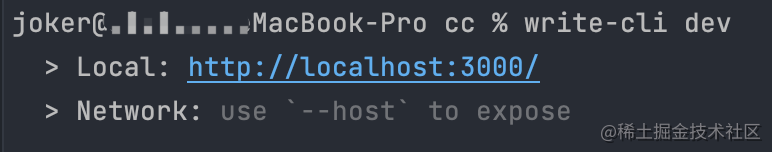
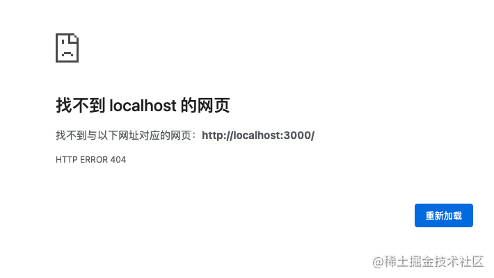
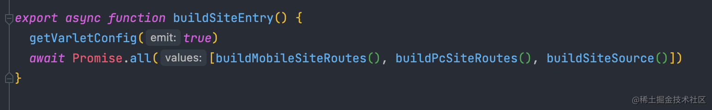
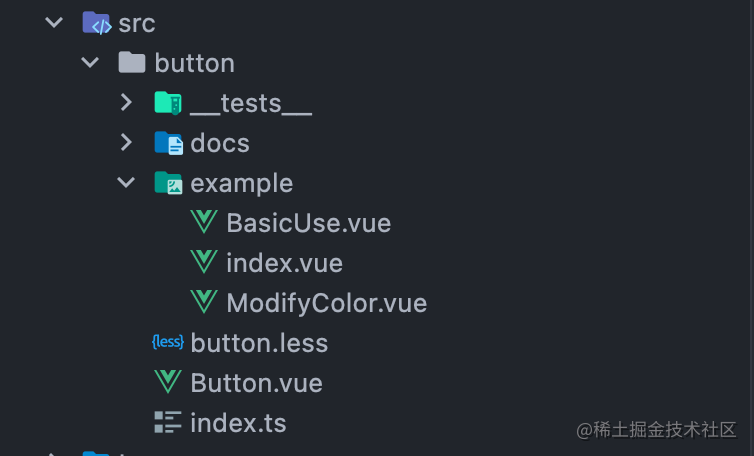
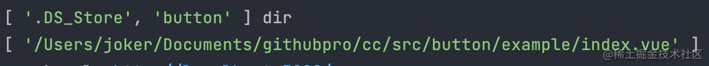
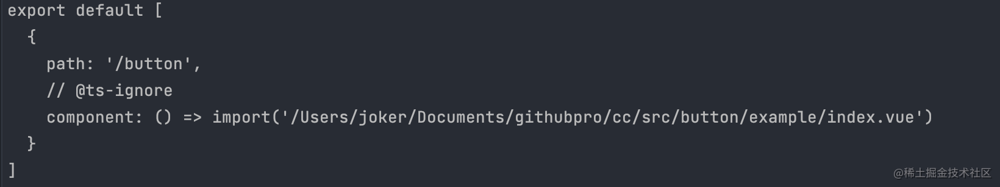
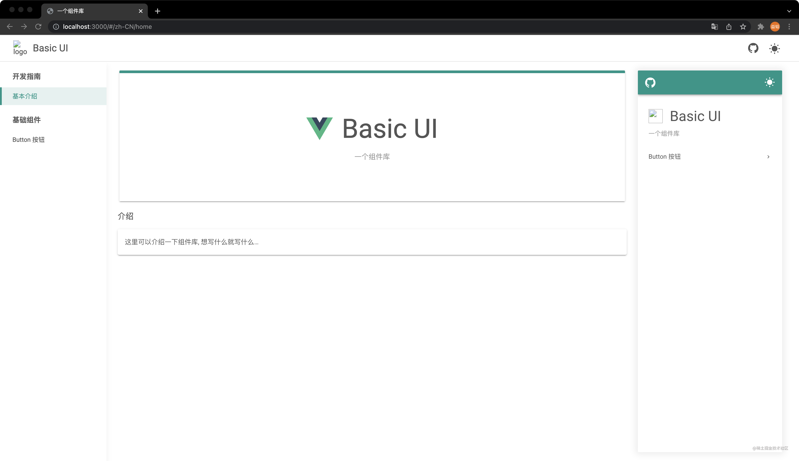

## 写在前面

相信已经有不少小伙伴们已经实现了自己`cli`工具的`gen`命令了。

接下来我们来讲讲如何实现一个`dev`命令，并通过`dev`命令来启动项目。

<!-- more -->

## 准备工作

有了前面几篇的铺垫，到这里相信同学们已经知道接下来我要做什么了。

我们回到`src/index.ts`,写下

```ts
program.command('dev').description('Run varlet development environment').action(dev)
```

用来接收一个`dev`命令，而具体要做的处理，我们一样放在`src/commands/dev`中,对外暴露一个`dev`方法。


## dev要做的事

我们先手动将运行环境切换为`dev`

```ts
process.env.NODE_ENV = 'development'
```

然后我们需要确保输入名称的地方存在项目文件

```ts
const SRC_DIR = resolve(process.cwd(), 'src')
ensureDirSync(SRC_DIR)
```

当完成以上工作后，就可以启动项目了。

## startServer

我们用一个`startServer`函数来处理启动的业务逻辑。

```ts
let server

const startServer = async () =>{
  server = await createServer()
  await server.listen()
  server.printUrls()
}
```

到这里，我们就可以将服务启动起来了。



我们访问一下`http://localhost:3000/`



肯定会有同学们疑惑了，我服务不是起来了吗，怎么访问不到呢？

其实啊很简单,因为我们没有进行站点的构建，所以没法访问对应的站点资源。

举个例子，我们在`cli`创建的的项目根目录，新建一个`index.html`，然后看看浏览器这边是不是就可以正常显示了呢。

既然知道了这个问题，那我们接下来就来完成站点的构建。

## 站点构建

我们定义一个`buildSiteEntry`函数用于处理站点构建。



从`varlet-cli`的源码中，我们可以看出`buildSiteEntry`一共做了三件事

**1** 构建移动端站点的路由

**2** 构建pc端站点的路由

**3** 生成站点资源 

本文我们以`1`为例进行剖析，对`2`感兴趣的小伙伴们可以访问我们的[代码仓库](https://github.com/varletjs/varlet/blob/dev/packages/varlet-cli/src/compiler/compileSiteEntry.ts)进行查看。



从图中我们可以分析出来，我们需要将每个组件下`example`的`index.vue`作为页面，添加到路由中。

```ts
// 获取src目录下的文件
const dir: string[] = await readdir('src')

// 拼接页面地址
const buildPath = (filename: string) => resolve('src', filename, 'example', 'index.vue')

// 判断是否存在对应地址
const existPath = (filename: string) => pathExistsSync(buildPath(filename))

// 通过slash转换`/`
const slashPath = (filename: string) => slash(buildPath(filename))

// 生成地址
const examplePaths = dir.filter(existPath).map(slashPath) 
```



从上面我们拿到了所有的页面地址，接下来就是填充`route`。

```ts
 const routes = examplePaths.map(
    (examplePath) => `
  {
    path: '${'/' + examplePath.match(//([-\w]+)/example/index.vue/)?.[1]}',
    // @ts-ignore
    component: () => import('${examplePath}')
  }\
`
  )

  const source = `export default [\
  ${routes.join(',')}
]`
```



至此我们就完成了路由的动态创建，接下来就是文件写入了。

我们创建一个`outputFileSyncOnChange`用于处理问文件写入

```
const outputFileSyncOnChange = (path: string, code: string) => {
  ensureFileSync(path)
  const content = readFileSync(path, 'utf-8')
  if (content !== code) {
    outputFileSync(path, code)
  }
}
```

接下来 我们调用`outputFileSyncOnChange`函数，将路由写入到文件中。

```
outputFileSyncOnChange(resolve(process.cwd(), '.varlet/mobile.routes.ts'), source)
```

接下来就是站点文件的生成。

我们将`site`文件夹(存放的站点文件)拷贝到当前运行的目录下。

```
copy(resolve(__dirname, '../../site'), resolve(process.cwd(), '.varlet/site'))
```

接下来，我们添加一些`vite`的配置

```ts
const inlineConfig =  {
  root: resolve(process.cwd(), '.varlet/site'),
  resolve: {
    extensions:['.vue', '.tsx', '.ts', '.jsx', '.js', '.less', '.css'],
    alias: {'@config':  resolve(process.cwd(), '.varlet/site.config.json'),
      '@pc-routes':  resolve(process.cwd(), '.varlet/pc.routes.ts'),
      '@mobile-routes': resolve(process.cwd(), '.varlet/mobile.routes.ts') },
  },
  plugins: [
    vue({
      include: [/.vue$/, /.md$/],
    }),
    md({ style: 'highlight.style' }),
  ],
}

server = await createServer(inlineConfig)
```


然后我们通过`you-cli-name dev`重新跑一遍。



这不就跑起来了嘛~~~

## 最后

以上就是`dev`命令的相关内容了，跟`varlet-cli`的`dev`相比有一些删减。

> 更详细的内容请移步我们的[代码仓库](https://github.com/varletjs/varlet),欢迎star && pr


