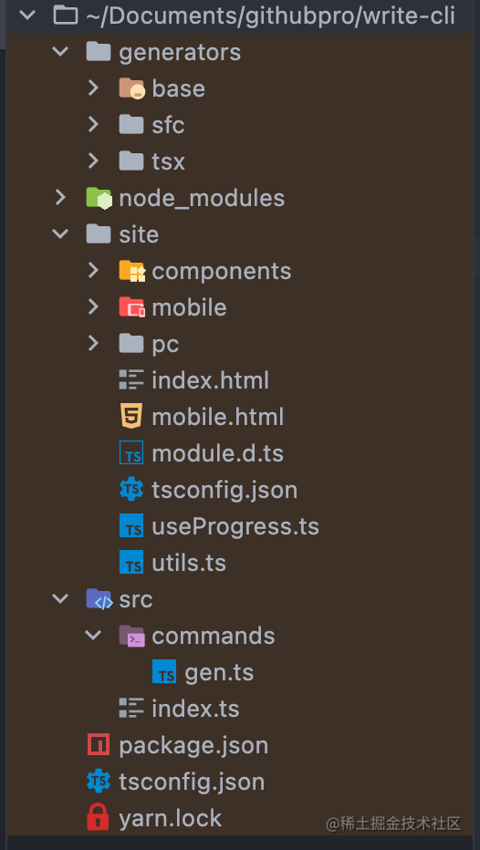
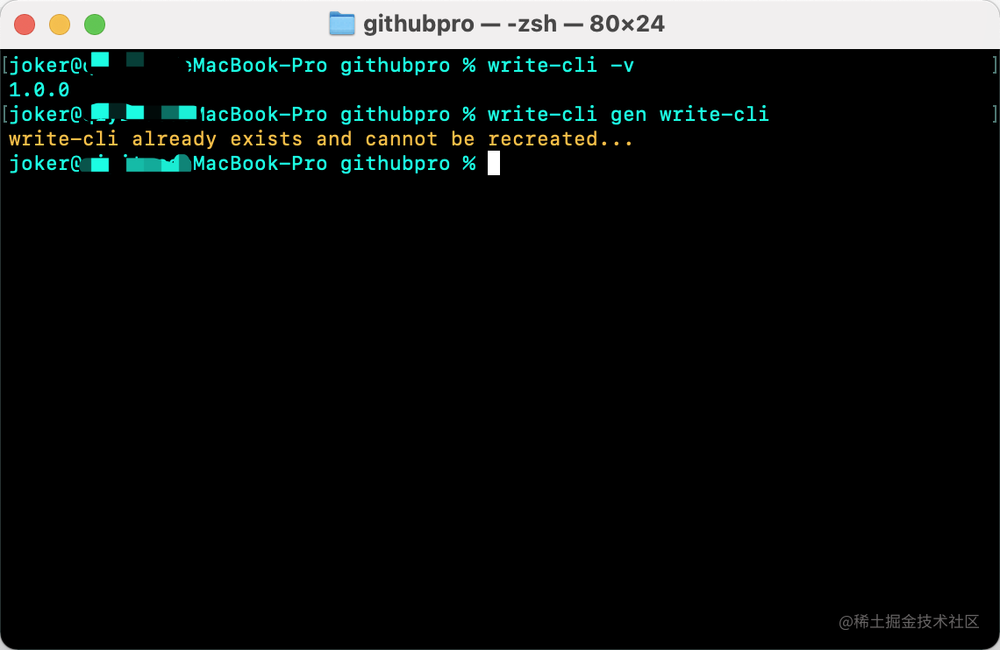
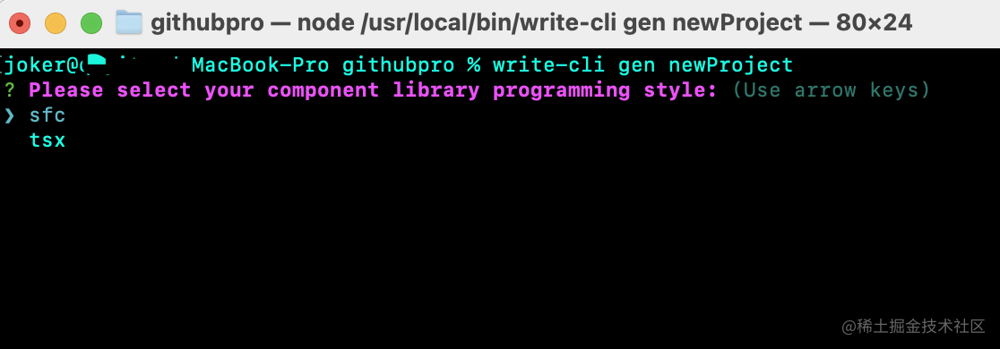
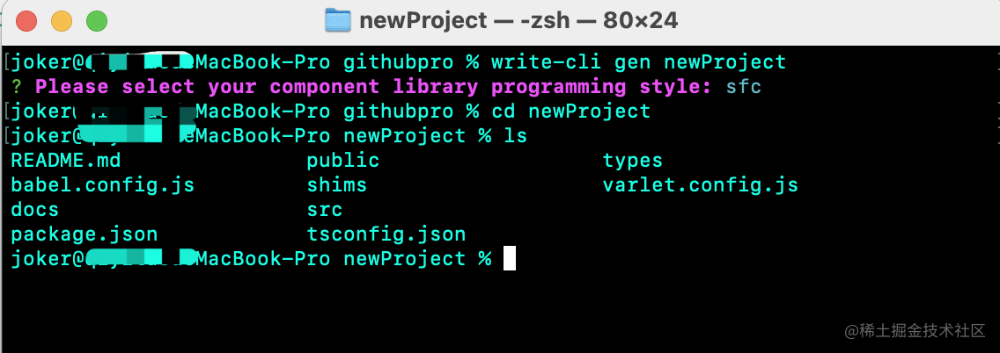
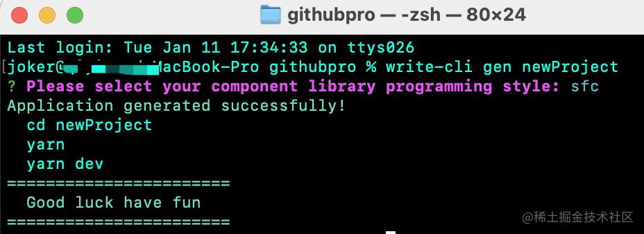

## 写在前面

到这里，相信小伙伴们已经对`cli`搭建要使用的工具有了一定了解。如果对相应的工具比较陌生，可以移步本[专栏](https://juejin.cn/column/7047326390311452679) 的前几篇内容。里面有相应介绍。

从这篇开始，我们将一步步得实现`cli`中的一些功能。

<!-- more -->

## 构建命令

在`varlet-cli`中，我们使用`gen`作为我们的构建命令，先介绍一下什么是`gen`。

`gen`为`generate`的简写，用法与我们熟知的`vuecli`的`create`类似，用来创建一个组件库项目。

当然，小伙伴们也可以使用各种自己喜欢的命令名~本篇我们依旧以`gen`作为我们的构建命令。

## 前期准备

我们先将项目的目录结构调整一下。



- `generators`:用于存放`gen`命令构建出项目的模板文件

- `site`:用于存放文档站点

- `src`:不用多说，`cli`的核心部分都在这里了

> 因为本文以`cli`的搭建为主，`generators`和`site`部分的代码我们不做过多笔墨，有兴趣的小伙伴们可以前往我们的 [代码仓库](https://github.com/varletjs/varlet)查看

## 老朋友commander

在之前的[《进阶篇：好用的工具(上)》](https://juejin.cn/post/7049371534380498951)中我们已经对`commander`的基本使用做了介绍，接下来就是让它发挥实力的时候了。

### Step1.引用

```ts
import { Command }  from "commander"

const program = new Command()

program.version(require('../package.json').version, '-v, --version')

program.parse()
```

### 创建gen命令

我们在`src/commands/gen`中暴露一个`gen`方法用来处理`gen`命令

```ts
export function gen(name:string){
   // some code do gen action
}
```

然后我们在入口文件中使用这个`gen`方法。

```ts

import { gen } from './commands/gen'

program.command('gen <name>').description('Generate cli application').action(gen)
```

## gen要做啥

既然命令已经有了，我们要先明确`gen`要做的事情：

- 接收用户输入的项目名称
- 检测当前目录中是否已经存在同名目录，有则提示，无则继续流程
- 提示用户选择模板
- 将用户选择的模板拷贝到目的目录
- 提示用户创建完成

接下来我们将按上面的步骤逐步实现`gen`

## 同名检测

我们接受用户输入的`name`，并拼接最终路径，通过`fs-extra`的`pathExistsSync`方法判读该路径是否存在。

如果存在则提示并终止程序。

```ts
const dest = resolve(process.cwd(), name)
if(pathExistsSync(dest)){
    logger.warning(`${name} already exists and cannot be recreated...`)
    return
}
```

> 我们在`write-cli`项目的同级目录试一下`gen`




## 选择模板

我们使用`inquirer`来编辑交互

```ts
const ret = await inquirer.prompt([
  {
    name: 'Please select your component library programming style',
    type: 'list',
    choices: ['sfc', 'tsx'],
  },
])
const choice = ret['Please select your component library programming style']
```

这里的`choice`就是用户选择的模板类似




## 拷贝模板

我们先定义模板所在目录，然后拿到项目的基本文件目录以及模板目录，然后将其拷贝到定义项目的目录中。

```ts
export const GENERATORS_DIR = resolve(__dirname, '../../generators')

const generator = resolve(GENERATORS_DIR, choice)
const base = resolve(GENERATORS_DIR, 'base')

await copy(base, dest)
await copy(generator, dest)
```



这样我们就完成了项目的创建。

## 提示完成

但是这样突然就完成了是不是有些不太友好呢，接下来我们来加入提示。

```ts
logger.success('Application generated successfully!')
logger.info(`\
  cd ${name}
  yarn
  yarn dev`)
  logger.success(`\
=======================
  Good luck have fun
=======================\
      `)
```



## 最后

以上就是`gen`命令的相关内容了，跟`varlet-cli`的`gen`相比删减了一些不影响正常创建的内容。

> 请参考[相关依赖版本](https://github.com/varletjs/varlet/blob/dev/packages/varlet-cli/package.json),更详细的[gen](https://github.com/varletjs/varlet/blob/dev/packages/varlet-cli/src/commands/gen.ts),本文中用到的[logger](https://github.com/varletjs/varlet/blob/dev/packages/varlet-cli/src/shared/logger.ts)


