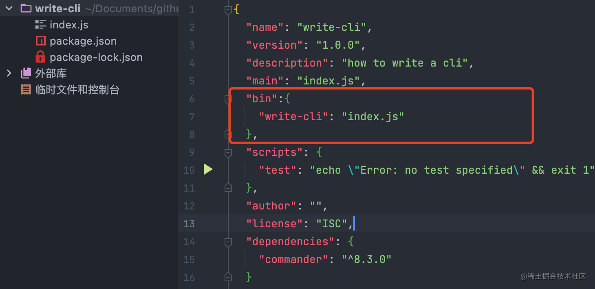
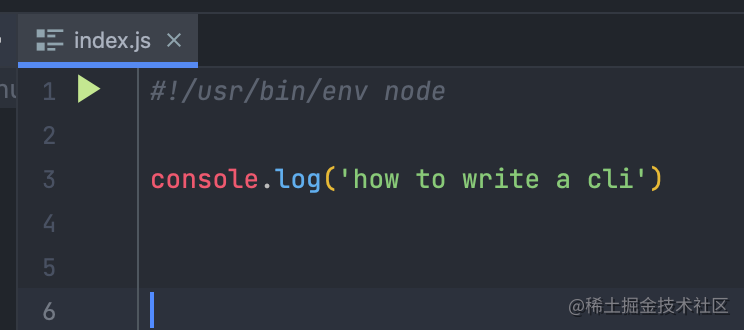
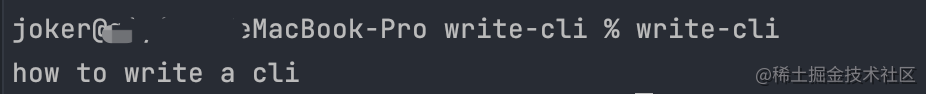
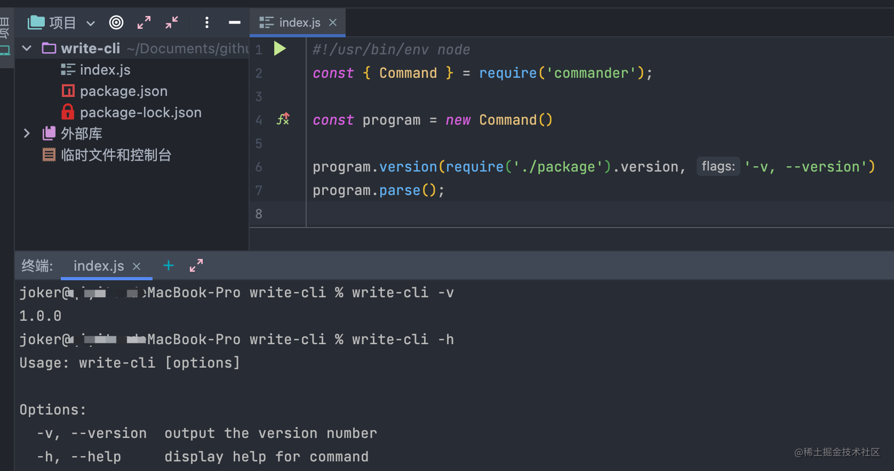
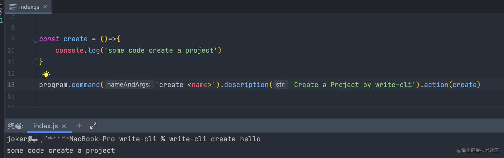
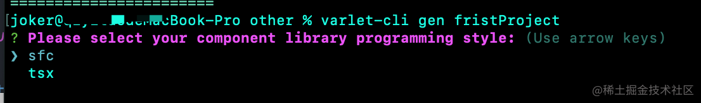
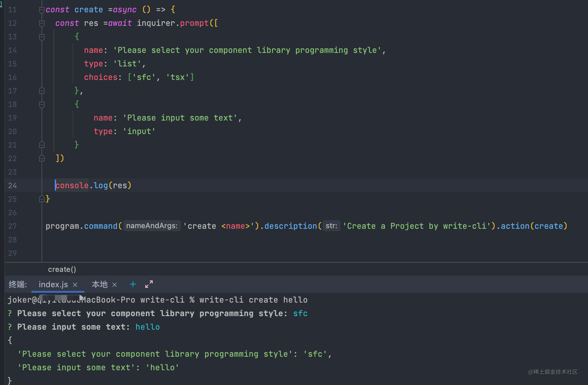
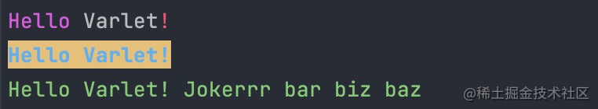

## 前言

在`cli`的开发工程中，我们用上了一些好用的工具，这极大的提升了我们的开发效率。

在本篇中，我将对这些好用的工具进行介绍。

> **注意：以下所有示例均以 Macos 环境为例**


<!-- more -->

## 准备工作

- 我们先新建一个空项目，然后打开命令行进入到该项目中
- 执行`npm init`完成项目初始化
- 此时我们的工程中应该有一个`package.json`文件， 在该文件中增加`bin`配置，如下图所示


- 其中，`write-cli`是cli工具的名称，对应的 value 值是文件入口
- 编辑`index.js`，内容如下：

**这里的第一行非常重要！！！**\
**这里的第一行非常重要！！！**\
**这里的第一行非常重要！！！**

用来指明运行环境

然后我们通过`npm link`进行本地安装，然后再执行`write-cli`,就可以看到运行效果了




## commander

### 介绍

`commander`是`nodejs`命令行操作的完整解决方案，提供了用户命令行输入和参数解析强大功能。

### 安装

```shell
npm install commander
```

### 基本用法

```
const { Command } = require('commander');
const program = new Command()
program.version(require('./package').version, '-v, --version')
program.parse();
```



当你出现这样的信息时，说明你已经掌握了`commander`的基本用法

### create原来如此简单

相信不少小伙伴们都用过`Vue CLI`或者`create-react-app`这些著名的`cli`工具，里面肯定少不了创建项目的命令`create`，我们就一起来看看`create`是如何工作的吧



一些解释：

- 我们通过`.command()`类配置`create`命令。第一个参数为命令名称。命令参数跟在名称后面
- 尖括号表示参数可为必选(方括号为可选)
- `description`为命令的描述
- `action`处理子级命令

> 具体的`create`的代码实现,将会在后续的篇幅中更详细的讲解

## inquirer

我们在使用`cli`中不可避免的会有一些命令行交互。

在上文提到的两个出色的脚手架的使用中以及我们`npm init`时都出现了一些用户交互。

因此在我们的`cli`项目中要使用这样的交互的话，就不得不介绍一下`inquirer`了。

### 安装

```shell
npm install inquirer
```

### 常见用法

我们以[varlet-cli](https://varlet.gitee.io/varlet-ui/#/zh-CN/cli)为例来实现选择的交互



我们来改写一下`create`

```js
const create = ()=>{
  inquirer.prompt([
    {
        name: 'Please select your component library programming style',
        type: 'list',
        choices: ['sfc', 'tsx'],
    },
  ])
}
```

再次执行`write-cli create hello`，相信聪明的你已经跑出来了跟上图一样的界面界面了。

看到这里，相信有小伙伴们会有新的疑问了，如何捕获用户的输入或者选择呢。

不急，我们慢慢往下看

```js
inquirer.prompt([
  {
    name: 'Please input some text',
    type: 'input' // 供用户输入
  }
])
```
然后我们从官方的文档中的

`inquirer.prompt(questions, answers) -> promise`

我们可以看出，用户的输入以`promise`的形式返回

因此我们使用`async await`来接收用户的输入

这样我们就完成了捕获



## chalk

我们可以通过`chalk`来是我们的命令行颜色变得丰富多彩。

### 安装

```
npm install chalk 
```
> **在本文中为了方便演示 我们使用4.1.2版本**

### 简单使用

我们举几个栗子🌰

```js
const log = console.log;

log(chalk.magenta('Hello') + ' Varlet' + chalk.red('!'));

log(chalk.blue.bgYellow.bold('Hello Varlet!'));

log(chalk.green('Hello', 'Varlet!', 'Jokerrr', 'bar', 'biz', 'baz'));
```


在`cli`中我们会将不同的提示信息用不同的色彩区分开进行输出。

## 最后

以上为我们用到的一部分工具库，还有一些同样好用的库我将在《进阶篇：好用的工具(下)》中继续介绍，敬请期待。

> 参考文档 [commander](https://github.com/tj/commander.js),[inquirer](https://github.com/SBoudrias/Inquirer.js),[chalk](https://github.com/chalk/chalk),