## 前言

在上篇[《进阶篇：好用的工具(上)》](https://juejin.cn/post/7049371534380498951/)中，我们已经介绍了一部分工具。

在这文中，我们将介绍剩下的那些工具。

> **注意：以下所有示例均以 Macos 环境为例**


<!-- more -->

## execa

通过这个工具，我们可以在代码里执行命令行指令。

### 安装

```
npm install execa
```

### 使用

```js
const execa = require('execa')

execa('git',['--version']).stdout.pipe(process.stdout);
execa('node',['-v']).stdout.pipe(process.stdout);
```

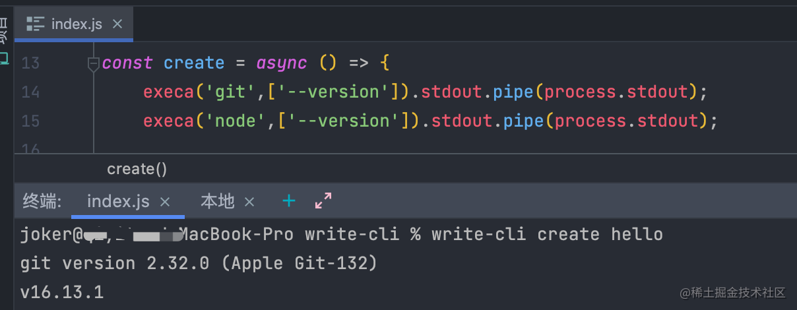
> 有关Node知识的一些介绍可以看一下[《基础篇：Node知识储备》](https://juejin.cn/post/7048086492870082597)\
> **在本文中为了方便演示 我们使用5.1.1版本**

我们甚至可以用来做一些`git`操作

```
execa('git',['clone','https://github.com/varletjs/varlet.git']).stdout.pipe(process.stdout);
```

> 讲到这里，相信聪明的你已经想到了一个最简单的实现`cli`的方式，那就是通过命令行直接从远端将项目模板拉过来


对应的git命令可以使用

```
git clone -b [branch] [repo url] [folderName/user input]

execa('git',['clone','-b','dev','https://github.com/varletjs/varlet.git','niubi']);
```

## ora

在项目创建的过程中，难免会遇到等待的情况。

以上面我们执行`git clone`为例，详细不少小伙伴们已经尝试过了，是不是发现在`clone`的过程中一点提示都没有，体验上非常的不友好。

这个时候我们就可以使用`ora`来加上一个过程动画。

### 安装

```
npm install ora
```

### 使用

我们依旧以上面`git clone`为例

```js
const ora = require('ora');
const execa = require("execa");

const spinner = ora(`Loading，please wait for a moment`).start();
await execa('git',['clone','-b','dev','https://github.com/varletjs/varlet.git','niubi'])
spinner.succeed('Loaded succeed')
```
当你的命令行中出现如下的这样一个小东西的时候，说明你的`ora`已经成功运作了

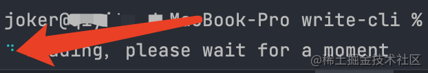

加载完成提示


## fs-extra

`node`本身提供了`fs`模块，但用起来多有不便。

相比较而言`fs-extra`这个库用起来就方便多了，添加了未包含在原生`fs`模块中的文件系统方法，并向`fs`方法添加了promise支持。不过需要使用`node`的版本为**10.12.0**版本或以上。

> 在祖师爷的`vue-next`中也使用了此库

### 安装

```shell
npm install fs-extra
```

### 常见用法

#### copy 复制
```js
fs.copy('myfile.js', 'mynewfile.js', err => {
    if (err) return console.error(err)
    console.log('success!')
}) 
```

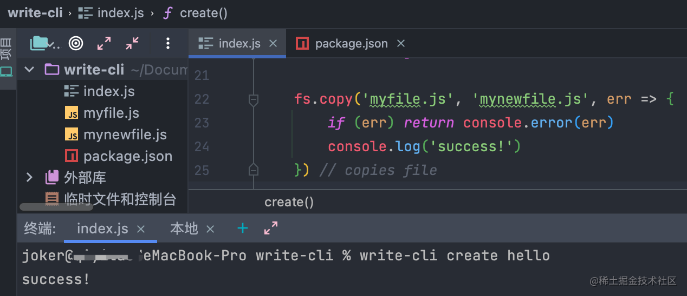

#### ensureDir 创建目录

确保目录的存在。如果目录结构不存在,就创建一个。

```js
fs.ensureDir('./src')
```

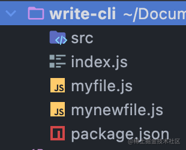

#### createWriteStream 可写流
```js
const writer =  fs.createWriteStream('./myfile.txt')
writer.write('Hello')
```
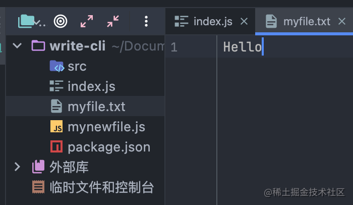

这个时候就有细心的小伙伴发现了，我们改变要写的内容，每次都会将全部内容重写，那如何才能接在已有的内容后继续写入呢？

别急，这不就来了嘛~

```js
const writer =  fs.createWriteStream('./myfile.txt',{ flags:'a' })
writer.write(' Varlet')
```

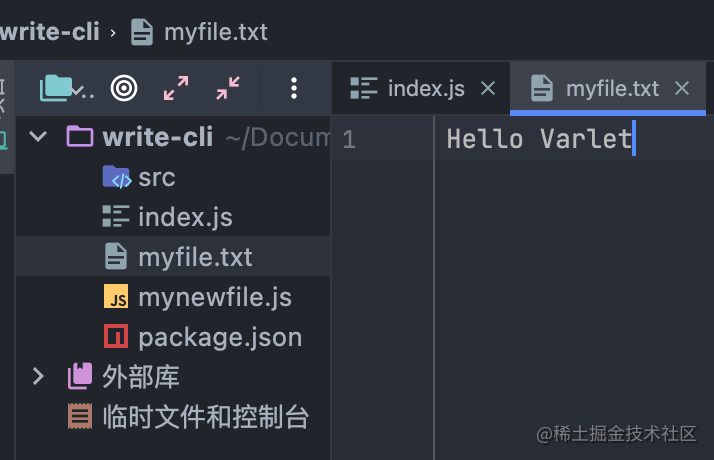

#### outputFile 写入文件

这个方法乍一看与`writeFile`类似，区别在于，当要写入的文件不存在时，该方法会创建一个目标文件。

```js
fs.outputFile('mynewfile.txt', 'hello varlet!')
fs.outputFile('anotherfile.txt', 'hello varlet!')
```
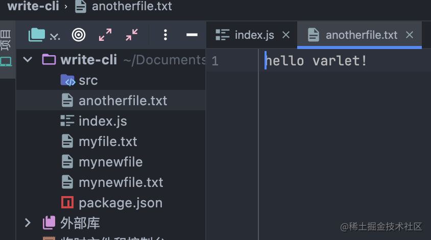

#### remove 删除
```js
fs.remove('anotherfile.txt', function(err) {
    if (err) return console.error(err)
    console.log("success!")
})
```
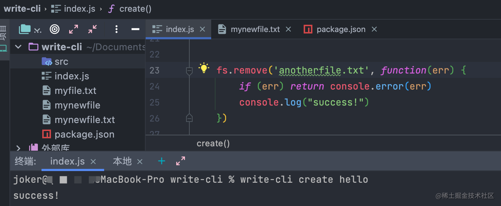


#### pathExists 路径检查

```js
fs.pathExists('index.js', (err, exists) => {
    if (err) return console.log(err);
    console.log(exists);
});

fs.pathExists('anotherfile.txt', (err, exists) => {
    if (err) return console.log(err);
    console.log(exists);
});
```

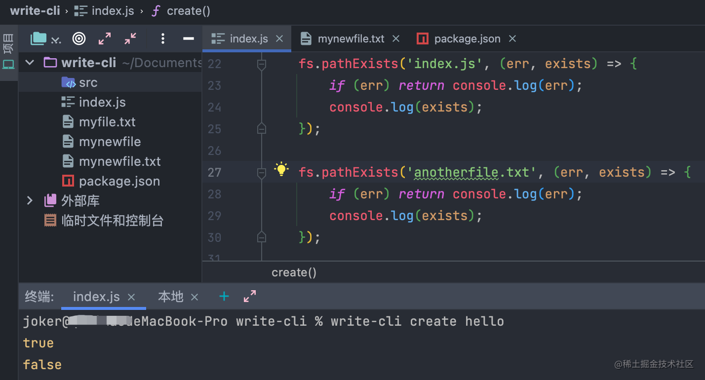

#### readdir 读取文件目录

```js
fs.readdir('src',(err,files)=>{
    if(err) return console.log(err);
    console.log(files)
})
```

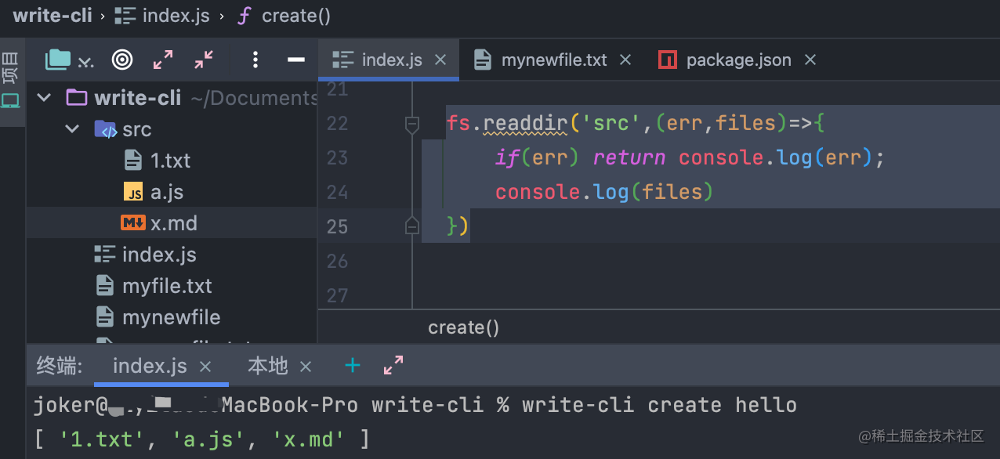

## slash

用于转换 Windows 反斜杠路径转换为正斜杠路径 `\ => /`

### 安装

```shell
npm install slash
```

### 使用

```js
const string = path.join('foo', 'bar');
// Unix    => foo/bar
// Windows => foo\bar

slash(string);
// Unix    => foo/bar
// Windows => foo/bar
```

## hash-sum

超快的独特哈希生成器。

> 祖师爷的`vue-next`中我们也可以看到此库的身影

### 安装

```shell
npm i hash-sum -S
```

### 使用

```js
const hash = require('hash-sum');

hash(value)
```

> 在`varlet-cli`中我们用它来处理`style scoped`

## chokidar

我们使用`chokidar`来监控文件变化

### 安装

```shell
npm install chokidar
```

### 使用

```js
chokidar.watch('.').on('all', (event, path) => {
    console.log(event, path);
});
```

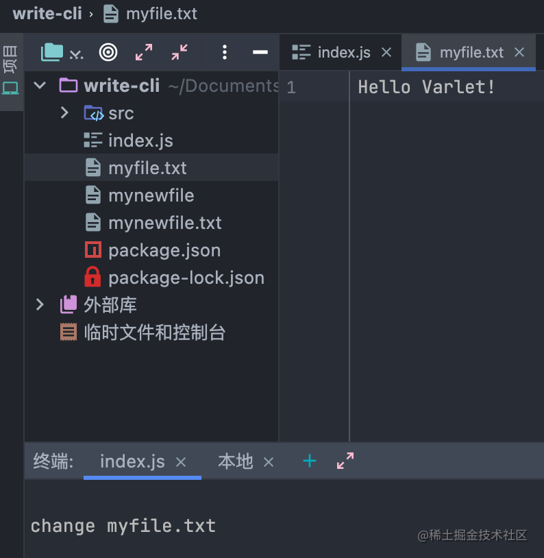

> 详细已经有聪明的小伙伴联想到了`dev`模式下，我们完成文件的改动会完成服务的重启，其实正是利用了这个工具库


## 最后

以上，有关`cli`用到的工具的介绍先告一段落， 更多的用法可以见各工具的官方文档。


> 参考文档 [execa](https://github.com/sindresorhus/execa),[ora](https://github.com/sindresorhus/ora),[chokidar](https://github.com/paulmillr/chokidar),[fs-extra](https://github.com/jprichardson/node-fs-extra),[hash-sum](https://github.com/bevacqua/hash-sum),[slash](https://github.com/sindresorhus/slash)

