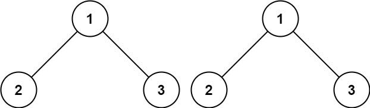
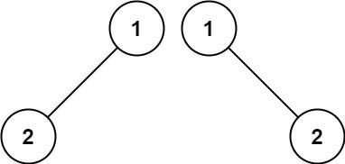
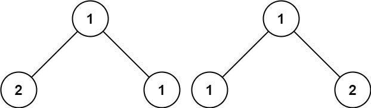
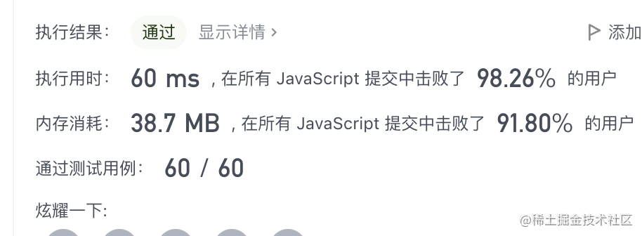

看一百遍美女，美女也不一定是你的。但你刷一百遍算法，知识就是你的了~~

谁能九层台，不用累土起!

[题目地址](https://leetcode-cn.com/problems/same-tree/)


<!-- more -->

## 题目

给你两棵二叉树的根节点 `p` 和 `q` ，编写一个函数来检验这两棵树是否相同。

如果两个树在结构上相同，并且节点具有相同的值，则认为它们是相同的。

**示例 1：**



```
输入： p = [1,2,3], q = [1,2,3]
输出： true
```

**示例 2：**



```
输入： p = [1,2], q = [1,null,2]
输出： false
```

**示例 3：**



```
输入： p = [1,2,1], q = [1,1,2]
输出： false
```

**提示：**

-   两棵树上的节点数目都在范围 `[0, 100]` 内
-   `-104 <= Node.val <= 104`


## 解题思路

- 作为暴力解的爱好者，这题我们依旧使用暴力解的方式
- 将两棵树转字符串进行比较

## 解题代码

```js
var isSameTree = function(p, q) {
    return JSON.stringify(p)==JSON.stringify(q)
};
```



看到这个执行结果，我人都麻了~~~

如有任何问题或建议，欢迎留言讨论！
