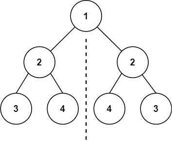
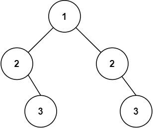

看一百遍美女，美女也不一定是你的。但你刷一百遍算法，知识就是你的了~~

谁能九层台，不用累土起!

[题目地址](https://leetcode-cn.com/problems/symmetric-tree/)


<!-- more -->

## 题目

给你一个二叉树的根节点 `root` ， 检查它是否轴对称。

**示例 1：**



```
输入： root = [1,2,2,3,4,4,3]
输出： true
```

**示例 2：**



```
输入： root = [1,2,2,null,3,null,3]
输出： false
```

**提示：**

-   树中节点数目在范围 `[1, 1000]` 内
-   `-100 <= Node.val <= 100`


## 解题思路

- 我们采用递归
- 判断如果两个节点都为空，那么对称
- 只有一个节点为空，不对称
- 我们毕竟左子树的右节点和右子树的左节点，同时比较左子树的左节点和右子树的右节点


## 解题代码

```js
var isSymmetric = function(root) {
    const check = (l,r)=>{
        if(!l&&!r) return true
        if(l&&!r||!l&&r) return false
        return l.val==r.val&&check(l.left,r.right)&&check(l.right,r.left)
    }
    return check(root,root)
};
```

如有任何问题或建议，欢迎留言讨论！
