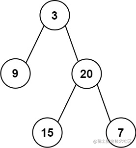

看一百遍美女，美女也不一定是你的。但你刷一百遍算法，知识就是你的了~~

谁能九层台，不用累土起!

[题目地址](https://leetcode-cn.com/problems/construct-binary-tree-from-preorder-and-inorder-traversal/)


<!-- more -->

## 题目

给定一棵树的前序遍历 `preorder` 与中序遍历 `inorder`。请构造二叉树并返回其根节点。

**示例 1:**



```
Input: preorder = [3,9,20,15,7], inorder = [9,3,15,20,7]
Output: [3,9,20,null,null,15,7]
```

**示例 2:**

```
Input: preorder = [-1], inorder = [-1]
Output: [-1]
```

**提示:**

-   `1 <= preorder.length <= 3000`
-   `inorder.length == preorder.length`
-   `-3000 <= preorder[i], inorder[i] <= 3000`
-   `preorder` 和 `inorder` 均无重复元素
-   `inorder` 均出现在 `preorder`
-   `preorder` 保证为二叉树的前序遍历序列
-   `inorder` 保证为二叉树的中序遍历序列

## 解题思路

- 我们需要知道前序遍历与中序遍历的特点：

    - 前序遍历的结果为 **根 | 左 | 右**
    - 中序遍历的结果为 **左 | 根 | 右**

- 所以我们可以很明确的知道根节点一定是前序的第一项
- 然后在中序遍历数组中我们可以通过根节点将左右子树分割开
- 分割前序数组中的左右子树
- 递归左右子树


## 解题代码

```js
var buildTree = function(preorder, inorder) {
  if(!inorder.length) return null
  let root = new TreeNode(preorder[0])
  let mid = inorder.indexOf(preorder[0])
  root.left = buildTree(preorder.slice(1,mid+1),inorder.slice(0,mid))
  root.right = buildTree(preorder.slice(mid+1),inorder.slice(mid+1,inorder.length))
  return  root
};
```

如有任何问题或建议，欢迎留言讨论！
