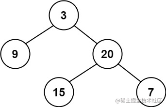
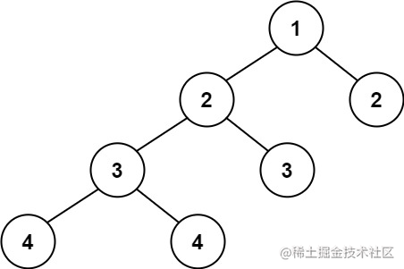

看一百遍美女，美女也不一定是你的。但你刷一百遍算法，知识就是你的了~~

谁能九层台，不用累土起!

[题目地址](https://leetcode-cn.com/problems/balanced-binary-tree/)


<!-- more -->

## 题目

给定一个二叉树，判断它是否是高度平衡的二叉树。

本题中，一棵高度平衡二叉树定义为：

> 一个二叉树*每个节点* 的左右两个子树的高度差的绝对值不超过 1 。

**示例 1：**




```
输入： root = [3,9,20,null,null,15,7]
输出： true
```

**示例 2：**



```
输入： root = [1,2,2,3,3,null,null,4,4]
输出： false
```

**示例 3：**

```
输入： root = []
输出： true
```

**提示：**

- 树中的节点数在范围 `[0, 5000]` 内
- `-104 <= Node.val <= 104`


## 解题思路

- 在求树的高度的同时，验证每个节点是否是平衡二叉树
- 递归到最下层的时候，求左子树的深度`l`，右子树的深度`r`
- 如果`Math.abs(l - r) < 1`，则返回当前子树的深度，供上层计算。 否则将判断结果标记为false，表明不是平衡二叉树。

## 解题代码

```js
var isBalanced = function(root) {
    let res = true
    function dfs(node){
        if(!node) return 0
        let l = dfs(node.left)
        let r = dfs(node.right)
        if(Math.abs(r-l)>1){
            res = false
        }  
        return Math.max(l,r)+1
    }
    dfs(root)
    return res
};
```

当你快乐时，你要想，这快乐不是永恒的；当你痛苦时，你要想，这痛苦也不是永恒的。

如有任何问题或建议，欢迎留言讨论！

