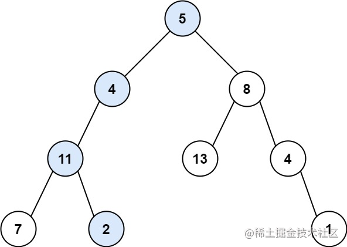
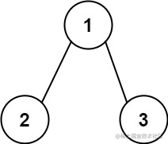

看一百遍美女，美女也不一定是你的。但你刷一百遍算法，知识就是你的了~~

谁能九层台，不用累土起!

[题目地址](https://leetcode-cn.com/problems/path-sum/)


<!-- more -->


## 题目

给你二叉树的根节点 `root` 和一个表示目标和的整数 `targetSum` 。判断该树中是否存在 **根节点到叶子节点** 的路径，这条路径上所有节点值相加等于目标和 `targetSum` 。如果存在，返回 `true` ；否则，返回 `false` 。

**叶子节点** 是指没有子节点的节点。

**示例 1：**




```
输入：root = [5,4,8,11,null,13,4,7,2,null,null,null,1], targetSum = 22
输出：true
解释：等于目标和的根节点到叶节点路径如上图所示。
```

**示例 2：**




```
输入：root = [1,2,3], targetSum = 5
输出：false
解释：树中存在两条根节点到叶子节点的路径：
(1 --> 2): 和为 3
(1 --> 3): 和为 4
不存在 sum = 5 的根节点到叶子节点的路径。
```

**示例 3：**

```
输入： root = [], targetSum = 0
输出： false
解释： 由于树是空的，所以不存在根节点到叶子节点的路径。
```

**提示：**

-   树中节点的数目在范围 `[0, 5000]` 内
-   `-1000 <= Node.val <= 1000`
-   `-1000 <= targetSum <= 1000`

## 解题思路

- 我们使用递归
- 如果当前节点存在`left`或`right`子节点，则将`targetSum`减去当前节点的值，并将结果带入下一次递归
- 如果当前节点是否为尾结点 是的话判断是否满足当前的`targetSum`等于当前根节点的`val`,是的话则存在，否则不存在

## 解题代码

```js
var hasPathSum = function(root, targetSum) {
  if(!root)  return false
  if(!root.left&&!root.right) return  root.val ==targetSum
  return hasPathSum(root.left,targetSum-root.val) || hasPathSum(root.right,targetSum-root.val)
};
```

不用期待命运在某个瞬间被突然扭转，那些改变我们人生的能量，都在普普通通的每一天里积累。

如有任何问题或建议，欢迎留言讨论！