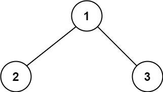
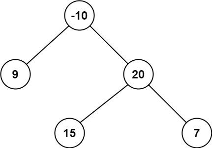

看一百遍美女，美女也不一定是你的。但你刷一百遍算法，知识就是你的了~~

谁能九层台，不用累土起!

[题目地址](https://leetcode-cn.com/problems/binary-tree-maximum-path-sum/)


<!-- more -->


## 题目

**路径** 被定义为一条从树中任意节点出发，沿父节点-子节点连接，达到任意节点的序列。同一个节点在一条路径序列中 **至多出现一次** 。该路径 **至少包含一个** 节点，且不一定经过根节点。

**路径和** 是路径中各节点值的总和。

给你一个二叉树的根节点 `root` ，返回其 **最大路径和** 。

**示例 1：**



```
输入： root = [1,2,3]
输出： 6
解释： 最优路径是 2 -> 1 -> 3 ，路径和为 2 + 1 + 3 = 6
```

**示例 2：**



```
输入： root = [-10,9,20,null,null,15,7]
输出： 42
解释： 最优路径是 15 -> 20 -> 7 ，路径和为 15 + 20 + 7 = 42
```

**提示：**

-   树中节点数目范围是 `[1, 3 * 104]`
-   `-1000 <= Node.val <= 1000`

## 解题思路

- 我们转变一下思路，先求出每个节点的路径最大值
- 当前节点路径的最大值等于当前节点的值加上左右大于0的节点值的最大值
- 根据当前节点路径的最大值与最大路径和的大小来更新当前节点路径的最大值

## 解题代码

```js
var maxPathSum = function(root) {
    let max = Number.MIN_SAFE_INTEGER
    const mmap = (node)=>{
        if(!node) return 0
        const left = mmap(node.left)
        const right = mmap(node.right)
        const m = node.val + (left>0?left:0)+ (right>0?right:0);
        max = Math.max(m,max)
        return node.val+Math.max(left>0?left:0,right>0?right:0)
    }
    mmap(root)
    return max
};
```

如有任何问题或建议，欢迎留言讨论！
