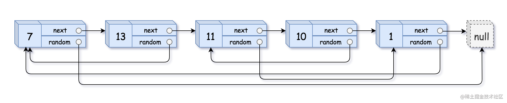

看一百遍美女，美女也不一定是你的。但你刷一百遍算法，知识就是你的了~~

谁能九层台，不用累土起!

[题目地址](https://leetcode-cn.com/problems/copy-list-with-random-pointer/)


<!-- more -->

## 题目
给你一个长度为`n`的链表，每个节点包含一个额外增加的随机指针`random`，该指针可以指向链表中的任何节点或空节点。

构造这个链表的深拷贝。深拷贝应该正好由`n`个全新节点组成，其中每个新节点的值都设为其对应的原节点的值。新节点的`next`指针和`random`指针也都应指向复制链表中的新节点，并使原链表和复制链表中的这些指针能够表示相同的链表状态。复制链表中的指针都不应指向原链表中的节点 。

例如，如果原链表中有`X`和`Y`两个节点，其中`X.random --> Y`。那么在复制链表中对应的两个节点`x`和`y`，同样有`x.random --> y`。

返回复制链表的头节点。

用一个由`n`个节点组成的链表来表示输入/输出中的链表。每个节点用一个`[val, random_index]`表示：
- `val`：一个表示`Node.val`的整数。
- `random_index`：随机指针指向的节点索引（范围从`0`到`n-1`）；如果不指向任何节点，则为`null`。

你的代码只接受原链表的头节点`head`作为传入参数。

**示例 1：**



```
输入：head = [[7,null],[13,0],[11,4],[10,2],[1,0]]
输出：[[7,null],[13,0],[11,4],[10,2],[1,0]]
```

**示例 2：**


```
输入： head = [[1,1],[2,1]]
输出： [[1,1],[2,1]]
```

**示例 3：**


```
输入： head = [[3,null],[3,0],[3,null]]
输出： [[3,null],[3,0],[3,null]]
```

**示例 4：**

```
输入： head = []
输出： []
解释： 给定的链表为空（空指针），因此返回 null。
```

> 提示：
> - `0 <= n <= 1000`
> - `-10000 <= Node.val <= 10000`
> - `Node.random` 为空（null）或指向链表中的节点。

## 解题思路

- 遍历一遍链表将链表每个节点的指针和值进行记录
- 再一次遍历链表，就可以从已记录的数组中拿到对应的`next`和`random`
- 设置已记录的数组中对应的`next`和`random`

## 解题代码

```js
var copyRandomList = function(head) {
    if(!head) return head
    let cur = head
    let map = new Map()
    while(cur){
        map.set(cur,new Node(cur.val))
        cur = cur.next
    }
    cur = head
    while(cur){
        map.get(cur).next = map.get(cur.next)||null
        map.get(cur).random = map.get(cur.random)||null
        cur = cur.next
    }
    return map.get(head)
};
```

如有任何问题或建议，欢迎留言讨论！
