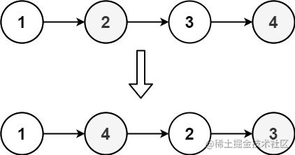
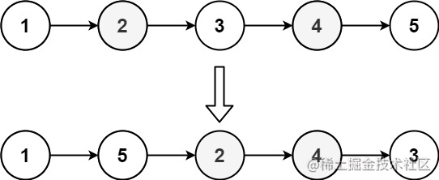

看一百遍美女，美女也不一定是你的。但你刷一百遍算法，知识就是你的了~~

谁能九层台，不用累土起!

[题目地址](https://leetcode-cn.com/problems/reorder-list/)


<!-- more -->

## 题目

给定一个单链表 `L` 的头节点 `head` ，单链表 `L` 表示为：

```
L0 → L1 → … → Ln - 1 → Ln
```

请将其重新排列后变为：

```
L0 → Ln → L1 → Ln - 1 → L2 → Ln - 2 → …
```

不能只是单纯的改变节点内部的值，而是需要实际的进行节点交换。

**示例 1：**




```
输入： head = [1,2,3,4]
输出： [1,4,2,3]
```

**示例 2：**




```
输入： head = [1,2,3,4,5]
输出： [1,5,2,4,3]
```

> 提示：
> - 链表的长度范围为 `[1, 5 * 104]`
> - `1 <= node.val <= 1000`


## 解题思路

- 我们先遍历一次链表利用数组来存储每个节点
- 然后遍历数组正序的同时我们也倒序遍历
- 当没有到数组的中间位置的时候，正序的每个节点的`next`指向倒序遍历到的节点
- 倒序遍历到的节点的`next`指向正序的下一个元素的节点
- 最后我们输出数组的第`0`项


## 解题代码

```js
var reorderList = function(head) {
   let arr = []
    while(head){
        let a = head
        head = head.next
        a.next = null
        arr.push(a)
    } 
    let i =0
    let j =arr.length-1
    while(i<j){
      arr[i].next = arr[j]
      if(i+1<j){
          arr[j].next = arr[i+1]
      }
      i++
      j--
    }
    return arr[0]
};
```

如果我们总在等待绝对的一切就绪，那我们将永远无法开始。
