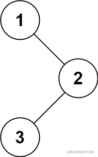
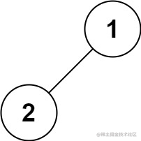
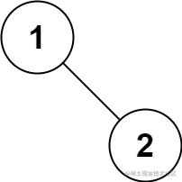

看一百遍美女，美女也不一定是你的。但你刷一百遍算法，知识就是你的了~~

谁能九层台，不用累土起!

[题目地址](https://leetcode-cn.com/problems/binary-tree-preorder-traversal/)

<!-- more -->
## 题目

给你二叉树的根节点 `root` ，返回它节点值的 **前序** **遍历。

**示例 1：**




```
输入： root = [1,null,2,3]
输出： [1,2,3]
```

**示例 2：**

```
输入： root = []
输出： []
```

**示例 3：**

```
输入： root = [1]
输出： [1]
```

**示例 4：**



```
输入： root = [1,2]
输出： [1,2]
```

**示例 5：**


```
输入： root = [1,null,2]
输出： [1,2]
```

**提示：**

-   树中节点数目在范围 `[0, 100]` 内
-   `-100 <= Node.val <= 100`

## 解题思路

- 前序遍历 `根 -> 左 -> 右`
- 处理好边界

## 解题代码

```js
var preorderTraversal = function(root) {
    let arr =[]
    function fomap(n){
        if(!n) return
        arr.push(n.val)
        if(n.left) fomap(n.left)
        if(n.right)fomap(n.right)
    }
    fomap(root)
    return arr
};
```

如有任何问题或建议，欢迎留言讨论！

