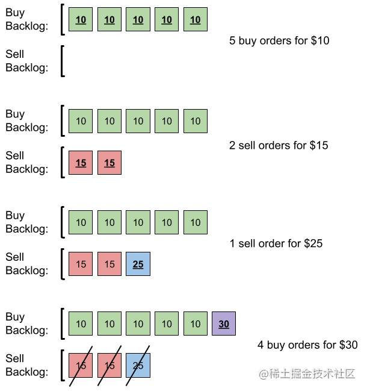
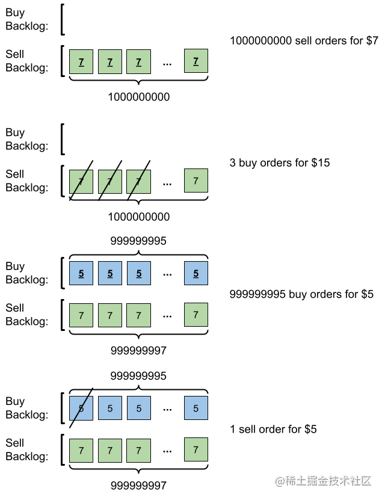

看一百遍美女，美女也不一定是你的。但你刷一百遍算法，知识就是你的了~~

谁能九层台，不用累土起!

[题目地址](https://leetcode-cn.com/problems/number-of-orders-in-the-backlog/)

<!-- more -->


## 题目

给你一个二维整数数组 `orders` ，其中每个 `orders[i] = [pricei, amounti, orderTypei]` 表示有 `amounti` 笔类型为 `orderTypei` 、价格为 `pricei` 的订单。

订单类型 `orderTypei` 可以分为两种：

-   `0` 表示这是一批采购订单 `buy`
-   `1` 表示这是一批销售订单 `sell`

注意，`orders[i]` 表示一批共计 `amounti` 笔的独立订单，这些订单的价格和类型相同。对于所有有效的 `i` ，由 `orders[i]` 表示的所有订单提交时间均早于 `orders[i+1]` 表示的所有订单。

存在由未执行订单组成的 **积压订单** 。积压订单最初是空的。提交订单时，会发生以下情况：

-   如果该订单是一笔采购订单 `buy` ，则可以查看积压订单中价格 **最低** 的销售订单 `sell` 。如果该销售订单 `sell` 的价格 **低于或等于** 当前采购订单 `buy` 的价格，则匹配并执行这两笔订单，并将销售订单 `sell` 从积压订单中删除。否则，采购订单 `buy` 将会添加到积压订单中。
-   反之亦然，如果该订单是一笔销售订单 `sell` ，则可以查看积压订单中价格 **最高** 的采购订单 `buy` 。如果该采购订单 `buy` 的价格 **高于或等于** 当前销售订单 `sell` 的价格，则匹配并执行这两笔订单，并将采购订单 `buy` 从积压订单中删除。否则，销售订单 `sell` 将会添加到积压订单中。

输入所有订单后，返回积压订单中的 **订单总数** 。由于数字可能很大，所以需要返回对 `109 + 7` 取余的结果。

**示例 1：**




```
输入： orders = [[10,5,0],[15,2,1],[25,1,1],[30,4,0]]
输出： 6
解释： 输入订单后会发生下述情况：
- 提交 5 笔采购订单，价格为 10 。没有销售订单，所以这 5 笔订单添加到积压订单中。
- 提交 2 笔销售订单，价格为 15 。没有采购订单的价格大于或等于 15 ，所以这 2 笔订单添加到积压订单中。
- 提交 1 笔销售订单，价格为 25 。没有采购订单的价格大于或等于 25 ，所以这 1 笔订单添加到积压订单中。
- 提交 4 笔采购订单，价格为 30 。前 2 笔采购订单与价格最低（价格为 15）的 2 笔销售订单匹配，从积压订单中删除这 2 笔销售订单。第 3 笔采购订单与价格最低的 1 笔销售订单匹配，销售订单价格为 25 ，从积压订单中删除这 1 笔销售订单。积压订单中不存在更多销售订单，所以第 4 笔采购订单需要添加到积压订单中。
最终，积压订单中有 5 笔价格为 10 的采购订单，和 1 笔价格为 30 的采购订单。所以积压订单中的订单总数为 6 。
```

**示例 2：**




```
输入： orders = [[7,1000000000,1],[15,3,0],[5,999999995,0],[5,1,1]]
输出： 999999984
解释： 输入订单后会发生下述情况：
- 提交 109 笔销售订单，价格为 7 。没有采购订单，所以这 109 笔订单添加到积压订单中。
- 提交 3 笔采购订单，价格为 15 。这些采购订单与价格最低（价格为 7 ）的 3 笔销售订单匹配，从积压订单中删除这 3 笔销售订单。
- 提交 999999995 笔采购订单，价格为 5 。销售订单的最低价为 7 ，所以这 999999995 笔订单添加到积压订单中。
- 提交 1 笔销售订单，价格为 5 。这笔销售订单与价格最高（价格为 5 ）的 1 笔采购订单匹配，从积压订单中删除这 1 笔采购订单。
最终，积压订单中有 (1000000000-3) 笔价格为 7 的销售订单，和 (999999995-1) 笔价格为 5 的采购订单。所以积压订单中的订单总数为 1999999991 ，等于 999999984 % (109 + 7) 。
```

**提示：**

-   `1 <= orders.length <= 105`
-   `orders[i].length == 3`
-   `1 <= pricei, amounti <= 109`
-   `orderTypei` 为 `0` 或 `1`

## 解题思路

- 首先我们要先理解题目的意思
    - 假设我们要买一批货，先比较目前我们目前摊位上在买的，如果在售卖的价钱低于买入价，则可以抵消数量，如果抵消完了还有的话，那就只能买进了
    - 对应的，当我们要卖的时候先看之前买进的货 看有没有比要卖的价格一样或高的， 可以抵消，抵消完了还有的话，还是得卖
    
我们用最大优先队列维护要买进的货， 用最小优先队列维护卖出的货，方便拿出来抵消

优先队列直接使用lodash的 [priority-queue](https://github.com/datastructures-js/priority-queue)

## 解题代码

```js
var getNumberOfBacklogOrders = function(orders) {
    let mod = 1000000007
    let buy = new MaxPriorityQueue({ priority: (bid) => bid.price })
    let sell = new MinPriorityQueue({ priority: (bid) => bid.price })
    let total = 0
    for(let [price,amount,orderType] of orders){
        if(orderType==0){// buy
            while(!sell.isEmpty()&&sell.front().priority<=price&&amount>0){
                let head = sell.dequeue().element
                if (amount < head.amount) {
                    sell.enqueue({price: head.price, amount: head.amount - amount})
                    total -= amount
                    amount = 0
                } else {
                    amount -= head.amount
                    total -= head.amount
                }
            }
            if (amount > 0) {
                buy.enqueue({price, amount})
                total += amount
            }
        }else{// sell
            while (!buy.isEmpty() && buy.front().priority >= price && amount > 0)  {
                let head = buy.dequeue().element
                if (amount < head.amount) {
                    buy.enqueue({price: head.price, amount: head.amount - amount})
                    total -= amount
                    amount = 0
                } else {
                    amount -= head.amount
                    total -= head.amount
                }
            }
            if (amount > 0) {
                sell.enqueue({price, amount})
                total += amount
            }
        }
    }
    return total%mod
};
```

如有任何问题或建议，欢迎留言讨论！
