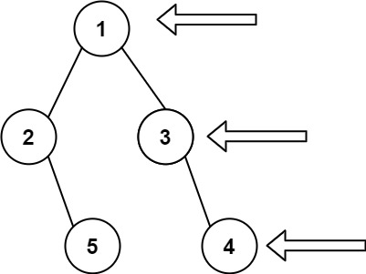

看一百遍美女，美女也不一定是你的。但你刷一百遍算法，知识就是你的了~~

谁能九层台，不用累土起!

[题目地址](https://leetcode-cn.com/problems/binary-tree-right-side-view/)

<!-- more -->


## 题目

给定一个二叉树的 **根节点** `root`，想象自己站在它的右侧，按照从顶部到底部的顺序，返回从右侧所能看到的节点值。

**示例 1:**



```
输入: [1,2,3,null,5,null,4]
输出: [1,3,4]
```

**示例 2:**

```
输入: [1,null,3]
输出: [1,3]
```

**示例 3:**

```
输入: []
输出: []
```

**提示:**

-   二叉树的节点个数的范围是 `[0,100]`
-   `-100 <= Node.val <= 100`

## 解题思路

- 我们使用层次遍历
- 记录下每次的右视图

## 解题代码

```js
var rightSideView = function(root) {
    if(!root) return []
    let res = []
    const mmap = (node,step)=>{
        if(!node) return 
        if(!res[step]) res[step] = node.val
        mmap(node.right,step+1)
        mmap(node.left,step+1)
    }
    mmap(root,0)
    return res
};
```

如有任何问题或建议，欢迎留言讨论！
