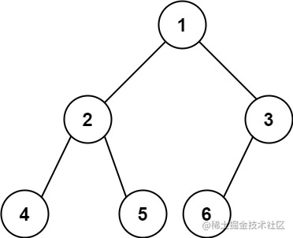

看一百遍美女，美女也不一定是你的。但你刷一百遍算法，知识就是你的了~~

谁能九层台，不用累土起!

[题目地址](https://leetcode-cn.com/problems/count-complete-tree-nodes/)

<!-- more -->


## 题目

给你一棵 **完全二叉树** 的根节点 `root` ，求出该树的节点个数。

[完全二叉树](https://baike.baidu.com/item/%E5%AE%8C%E5%85%A8%E4%BA%8C%E5%8F%89%E6%A0%91/7773232?fr=aladdin) 的定义如下：在完全二叉树中，除了最底层节点可能没填满外，其余每层节点数都达到最大值，并且最下面一层的节点都集中在该层最左边的若干位置。若最底层为第 `h` 层，则该层包含 `1~ 2h` 个节点。

**示例 1：**





```
输入： root = [1,2,3,4,5,6]
输出： 6
```

**示例 2：**

```
输入： root = []
输出： 0
```

**示例 3：**

```
输入： root = [1]
输出： 1
```

**提示：**

-   树中节点的数目范围是`[0, 5 * 104]`
-   `0 <= Node.val <= 5 * 104`
-   题目数据保证输入的树是 **完全二叉树**

## 解题思路

- 我们使用前序遍历
- 如果当前节点存在则加`1`并递归其左右子节点

## 解题代码

```js
var countNodes = function(root) {
  if(!root) return 0
  return  1 +  countNodes(root.left) + countNodes(root.right)
};
```

如有任何问题或建议，欢迎留言讨论！
