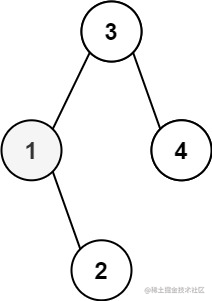
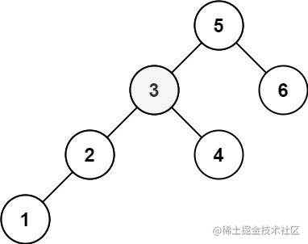

看一百遍美女，美女也不一定是你的。但你刷一百遍算法，知识就是你的了~~

谁能九层台，不用累土起!

[题目地址](https://leetcode-cn.com/problems/kth-smallest-element-in-a-bst/)

<!-- more -->


## 题目

给定一个二叉搜索树的根节点 `root` ，和一个整数 `k` ，请你设计一个算法查找其中第 `k` 个最小元素（从 1 开始计数）。

**示例 1：**



```
输入： root = [3,1,4,null,2], k = 1
输出： 1
```

**示例 2：**


```
输入： root = [5,3,6,2,4,null,null,1], k = 3
输出： 3
```

**提示：**

-   树中的节点数为 `n` 。
-   `1 <= k <= n <= 104`
-   `0 <= Node.val <= 104`


## 解题思路

- 我们使用中序遍历
- 因为搜索树的特性，我们可以获得一个升序数组
- 第`k`小就是数组的第`k-1`项

## 解题代码

```js
var kthSmallest = function(root, k) {
    let arr = []
    const mmap = (node)=>{
        if(!node) return
        mmap(node.left)
        arr.push(node.val)
        mmap(node.right)
    }
    mmap(root)
    return arr[k-1]
};
```

如有任何问题或建议，欢迎留言讨论！
