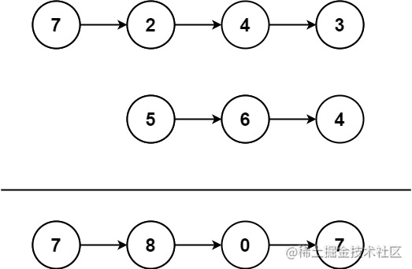

看一百遍美女，美女也不一定是你的。但你刷一百遍算法，知识就是你的了~~

谁能九层台，不用累土起!

[题目地址](https://leetcode-cn.com/problems/add-two-numbers-ii/)

<!-- more -->


## 题目

给你两个 **非空** 链表来代表两个非负整数。数字最高位位于链表开始位置。它们的每个节点只存储一位数字。将这两数相加会返回一个新的链表。

你可以假设除了数字 0 之外，这两个数字都不会以零开头。

**示例1：**



```
输入： l1 = [7,2,4,3], l2 = [5,6,4]
输出： [7,8,0,7]
```

**示例2：**

```
输入： l1 = [2,4,3], l2 = [5,6,4]
输出： [8,0,7]
```

**示例3：**

```
输入： l1 = [0], l2 = [0]
输出： [0]
```

> 提示：
> - 链表的长度范围为` [1, 100]`
> - `0 <= node.val <= 9`
> - 输入数据保证链表代表的数字无前导 0

## 解题思路

- 我们发现两个链表是倒序相加的
- 然后相加后的值大于等于`10`的，原节点记录个位上的数，十位上的数进入下一次求和的计算中
- 我们先将链表入栈
- 一边出栈一边做求和
- 然后构建节点
- 将新节点的next指向上一个构建的节点


## 解题代码

```js
var addTwoNumbers = function(l1, l2) {
    let arr1 =[]
    let arr2=[]
    while(l1||l2){
        if(l1){
            arr1.push(l1.val)
            l1=l1.next
        }
        if(l2){
            arr2.push(l2.val||0)
            l2=l2.next
        }
    }
    let sum = 0
    let head = null
    while(arr1.length||arr2.length||sum){
        let a =arr1.length?arr1.pop():0
        let b =arr2.length?arr2.pop():0
        let s = a+b +sum
        sum = parseInt(s / 10)
        let node = new ListNode(s%10)
        node.next = head
        head = node
    }
    return head
};
```


生活，一半是回忆，一半是继续，把所有的不快给昨天，把所有的希望给明天，把所有的努力给今天！

如有任何问题或建议，欢迎留言讨论！


