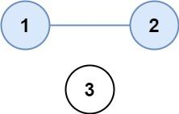
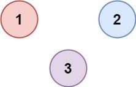

「这是我参与2022首次更文挑战的第7天，活动详情查看：[2022首次更文挑战](https://juejin.cn/post/7052884569032392740 "https://juejin.cn/post/7052884569032392740")」

看一百遍美女，美女也不一定是你的。但你刷一百遍算法，知识就是你的了~~

谁能九层台，不用累土起! 

[题目地址](https://leetcode-cn.com/problems/number-of-provinces/)

<!-- more -->


## 题目

有 `n` 个城市，其中一些彼此相连，另一些没有相连。如果城市 `a` 与城市 `b` 直接相连，且城市 `b` 与城市 `c` 直接相连，那么城市 `a` 与城市 `c` 间接相连。

**省份** 是一组直接或间接相连的城市，组内不含其他没有相连的城市。

给你一个 `n x n` 的矩阵 `isConnected` ，其中 `isConnected[i][j] = 1` 表示第 `i` 个城市和第 `j` 个城市直接相连，而 `isConnected[i][j] = 0` 表示二者不直接相连。

返回矩阵中 **省份** 的数量。

**示例 1：**



```
输入： isConnected = [[1,1,0],[1,1,0],[0,0,1]]
输出： 2
```

**示例 2：**



```
输入： isConnected = [[1,0,0],[0,1,0],[0,0,1]]
输出： 3
```

**提示：**

-   `1 <= n <= 200`
-   `n == isConnected.length`
-   `n == isConnected[i].length`
-   `isConnected[i][j]` 为 `1` 或 `0`
-   `isConnected[i][i] == 1`
-   `isConnected[i][j] == isConnected[j][i]`

## 解题思路

- 我们创建一个`visit`数组长度与矩阵的长度相同，用来标记该城市是否已经被处理
- 遍历矩阵`isConnected`矩阵长度次
- 如果遍历到的城市被标记为未处理，那么就进入处理函数，并将省份数量`+1`
- 处理函数接收一个数组索引
- 将该索引对应的城市数组标记为已处理
- 遍历这个城市数组，查看是否与其他城市有连接(`isConnected[i][i] == 1`)
- 如果存在有连接的并且还未被处理的城市，则进入处理

## 解题代码

```js
var findCircleNum = function(isConnected) {
    let visit =  new Array(isConnected.length).fill(0)
    let index = 0
    let count = 0
    const connect = function(i){
        visit[i] = 1
        for(let j = 0;j<isConnected.length;j++){
            if(isConnected[i][j]&&visit[j]==0) connect(j) 
        }
    }
    while(index<isConnected.length){
        if(visit[index]==0){
            count++
            connect(index)
        }
        index++
    }
    return count
};
```

如有任何问题或建议，欢迎留言讨论！
