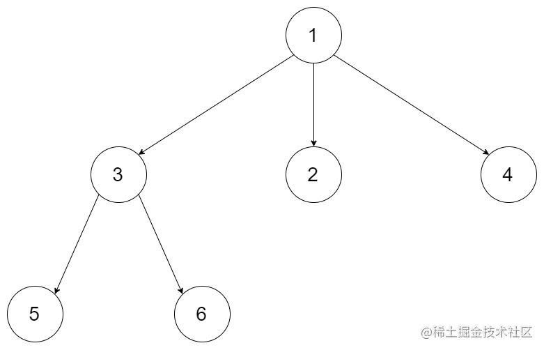
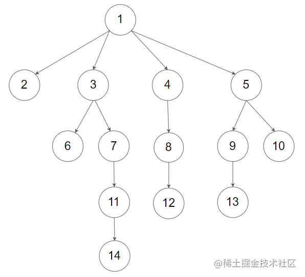

看一百遍美女，美女也不一定是你的。但你刷一百遍算法，知识就是你的了~~

谁能九层台，不用累土起!

[题目地址](https://leetcode-cn.com/problems/n-ary-tree-preorder-traversal/)

<!-- more -->


## 题目

给定一个 N 叉树，返回其节点值的 **前序遍历** 。

N 叉树 在输入中按层序遍历进行序列化表示，每组子节点由空值 `null` 分隔（请参见示例）。

**示例 1：**




```
输入： root = [1,null,3,2,4,null,5,6]
输出： [1,3,5,6,2,4]
```

**示例 2：**




```
输入： root = [1,null,2,3,4,5,null,null,6,7,null,8,null,9,10,null,null,11,null,12,null,13,null,null,14]
输出： [1,2,3,6,7,11,14,4,8,12,5,9,13,10]
```

**提示：**

-   N 叉树的高度小于或等于 `1000`
-   节点总数在范围 `[0, 10^4]` 内


## 解题思路

- N 叉树的前序遍历与二叉树类似，但是略有不同
- 如果该节点存在则存入数组 
- 如果该节点存在子节点则将每个子节点进入递归进行上面两步

## 解题代码

```
var preorder = function(root) {
    let arr = []
    if(!root) return []
    function fmap(node){
        if(node) arr.push(node.val)
        for(let i =0;i<node.children.length;i++){
            fmap(node.children[i])
        }
    }
    fmap(root)
    return arr
};
```

时间不会停下来等你，我们现在过的每一天，都是余生中最年轻的一天。

如有任何问题或建议，欢迎留言讨论！