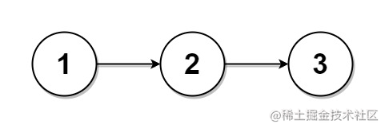
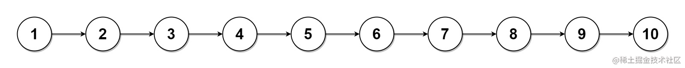

看一百遍美女，美女也不一定是你的。但你刷一百遍算法，知识就是你的了~~

谁能九层台，不用累土起!

[题目地址](https://leetcode-cn.com/problems/split-linked-list-in-parts/)

<!-- more -->


## 题目

给你一个头结点为 `head` 的单链表和一个整数 `k` ，请你设计一个算法将链表分隔为 `k` 个连续的部分。

每部分的长度应该尽可能的相等：任意两部分的长度差距不能超过 1 。这可能会导致有些部分为 null 。

这 `k` 个部分应该按照在链表中出现的顺序排列，并且排在前面的部分的长度应该大于或等于排在后面的长度。

返回一个由上述 `k` 部分组成的数组。

**示例 1：**




```
输入：head = [1,2,3], k = 5
输出：[[1],[2],[3],[],[]]
解释：
第一个元素 output[0] 为 output[0].val = 1 ，output[0].next = null 。
最后一个元素 output[4] 为 null ，但它作为 ListNode 的字符串表示是 [] 。
```

**示例 2：**




```
输入： head = [1,2,3,4,5,6,7,8,9,10], k = 3
输出： [[1,2,3,4],[5,6,7],[8,9,10]]
解释：
输入被分成了几个连续的部分，并且每部分的长度相差不超过 1 。前面部分的长度大于等于后面部分的长度。
```

**提示：**

-   链表中节点的数目在范围 `[0, 1000]`
-   `0 <= Node.val <= 1000`
-   `1 <= k <= 50`


## 解题思路

- 我们需要先拿到链表的长度

- 根据链表的长度和传入的`k`我们确定分割后每个链表的长度，以及有几个链表长度需要多`1`

- 创建一个长度为`k`的数组

- 遍历数组，对数组的每一项进行填充操作，具体操作如下：

    - 令数组当前所在项为当前的节点
    - 判断此分割的节点长度是否需要`+1`
    - 遍历到当前分割链表的最大长度后断开链表链接完成分割


## 解题代码

```js
var splitListToParts = function(head, k) {
  let len = 0
  let cur = head
  while (cur){
    cur = cur.next
    len++
  }
  let space = Math.floor(len/k)
  let more = len%k
  let arr = new Array(k).fill(null)
  cur = head
  for(let i=0;i<k&&cur;i++){
    arr[i] = cur
    let l = space + (i<more?1:0)
    for(let j = 1;j<l;j++){
      cur = cur.next
    }
    let temp = cur.next
    cur.next =null
    cur = temp
  }
  return  arr
};
```

如有任何问题或建议，欢迎留言讨论！

