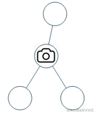
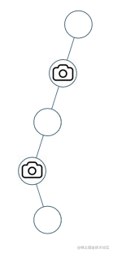

看一百遍美女，美女也不一定是你的。但你刷一百遍算法，知识就是你的了~~

谁能九层台，不用累土起!

[题目地址](https://leetcode-cn.com/problems/binary-tree-cameras/)

<!-- more -->


## 题目

给定一个二叉树，我们在树的节点上安装摄像头。

节点上的每个摄影头都可以监视**其父对象、自身及其直接子对象。**

计算监控树的所有节点所需的最小摄像头数量。

**示例 1：**




```
输入： [0,0,null,0,0]
输出： 1
解释： 如图所示，一台摄像头足以监控所有节点。
```
**示例 2：**



```
输入： [0,0,null,0,null,0,null,null,0]
输出： 2
解释： 需要至少两个摄像头来监视树的所有节点。 上图显示了摄像头放置的有效位置之一。
```

**提示：**

1.  给定树的节点数的范围是 `[1, 1000]`。
2.  每个节点的值都是 0。

## 解题思路

- 我们想要摄像头最少，那么就需要尽量往父节点装(装在父节点可以监视到两个子节点)
- 我们用`0`来表示没覆盖到的， `1`表示覆盖到的， `2`表示安装摄像头的位置
- 我们使用后续遍历
- 对父节点进行判断，如果节点安装了摄像头，首先数量`+1`,如果该节点的父节点存在且没被覆盖，则将其标为覆盖
- 如果该节点没被覆盖，我们先判断他有没有父节点，有的话将其父节点设为摄像头位，并将该节点标记为覆盖到
- 该节点为头结点，将其标记为摄像头位并数量`+1`

## 解题代码

```js
var minCameraCover = function(root) {
    let n = 0
    function preorder(node){
        if(node.left){
            node.left.parent = node
            preorder(node.left)
        }
        if(node.right){
            node.right.parent = node
            preorder(node.right)
        }
        if(node.val==2){
            n++
            if(node.parent&&!node.parent.val) node.parent.val=1
        }else if(node.val==0){
            if(node.parent) node.parent.val = 2,node.val = 1;
            else node.val = 2,n++;
        }
    }
    preorder(root)
    return n
};
```

时间不会停下来等你，我们现在过的每一天，都是余生中最年轻的一天。

如有任何问题或建议，欢迎留言讨论！
