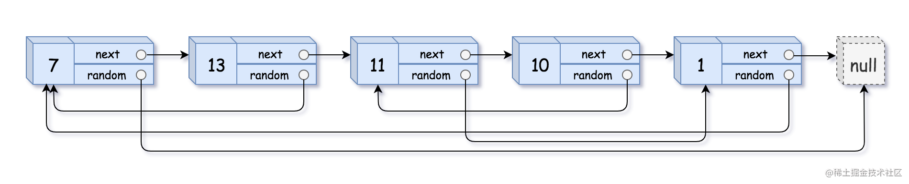

这世上没有人能随随便便成功，世界总是在偷偷奖励自律的人

看一百遍美女，美女也不一定是你的。但你刷一百遍算法，知识就是你的了~~

谁能九层台，不用累土起!

[题目地址](https://leetcode-cn.com/problems/fu-za-lian-biao-de-fu-zhi-lcof/)

<!-- more -->


## 题目

请实现 `copyRandomList` 函数，复制一个复杂链表。在复杂链表中，每个节点除了有一个 `next` 指针指向下一个节点，还有一个 `random` 指针指向链表中的任意节点或者 `null`。

**示例 1：**



```
输入：head = [[7,null],[13,0],[11,4],[10,2],[1,0]]
输出：[[7,null],[13,0],[11,4],[10,2],[1,0]]
```

**示例 2：**


```
输入： head = [[1,1],[2,1]]
输出： [[1,1],[2,1]]
```

**示例 3：**


```
输入： head = [[3,null],[3,0],[3,null]]
输出： [[3,null],[3,0],[3,null]]
```

**示例 4：**

```
输入： head = []
输出： []
解释： 给定的链表为空（空指针），因此返回 null。
```

> 提示：
> - `-10000 <= Node.val <= 10000`
> - `Node.random` 为空（null）或指向链表中的节点。
> - 节点数目不超过 1000 。

## 解题思路

本题与 [138_复制带随机指针的链表](https://juejin.cn/post/7040823587497836574) 相仿

> 提示：
> - `0 <= n <= 1000`
> - `-10000 <= Node.val <= 10000`
> - `Node.random` 为空（null）或指向链表中的节点。


## 解题代码

```js
var copyRandomList = function(head) {
    if(!head) return head;
   let map = new Map()
   let pre = head
   while(pre){
       map.set(pre,new Node(pre.val))
       pre = pre.next
   }
    pre = head
   while(head){
       map.get(head).next = map.get(head.next)?map.get(head.next):null
       map.get(head).random = map.get(head.random)
       head=head.next
   }
   return map.get(pre)
};
```

如有任何问题或建议，欢迎留言讨论！
