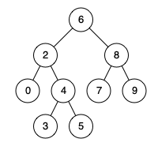

看一百遍美女，美女也不一定是你的。但你刷一百遍算法，知识就是你的了~~

谁能九层台，不用累土起!

[题目地址](https://leetcode-cn.com/problems/er-cha-sou-suo-shu-de-zui-jin-gong-gong-zu-xian-lcof/)

<!-- more -->


## 题目

给定一个二叉搜索树, 找到该树中两个指定节点的最近公共祖先。

[百度百科](https://baike.baidu.com/item/%E6%9C%80%E8%BF%91%E5%85%AC%E5%85%B1%E7%A5%96%E5%85%88/8918834?fr=aladdin)中最近公共祖先的定义为：“对于有根树 T 的两个结点 p、q，最近公共祖先表示为一个结点 x，满足 x 是 p、q 的祖先且 x 的深度尽可能大（**一个节点也可以是它自己的祖先**）。”

例如，给定如下二叉搜索树: root = [6,2,8,0,4,7,9,null,null,3,5]



**示例 1:**

```
输入: root = [6,2,8,0,4,7,9,null,null,3,5], p = 2, q = 8
输出: 6 
解释: 节点 2 和节点 8 的最近公共祖先是 6。
```

**示例 2:**

```
输入: root = [6,2,8,0,4,7,9,null,null,3,5], p = 2, q = 4
输出: 2
解释: 节点 2 和节点 4 的最近公共祖先是 2, 因为根据定义最近公共祖先节点可以为节点本身。
```

**说明:**

-   所有节点的值都是唯一的。
-   p、q 为不同节点且均存在于给定的二叉搜索树中。

## 解题思路

- 我们根据二叉搜索树的特点：`左<根<右`
- 当根节点比两个都大时，我们递归左节点
- 当根节点比两个都小时，我们递归右节点
- 当根节点比一个大，另一个小时就是我们要找的最近公共祖先节点

## 解题代码

```js
var lowestCommonAncestor = function(root, p, q) {
    if(!root) return root
    if(root.val<p.val&&root.val<q.val){
        return lowestCommonAncestor(root.right,p,q)
    }else if(root.val>p.val&&root.val>q.val){
        return lowestCommonAncestor(root.left,p,q)
    }else{
        return root
    }
};
```

如有任何问题或建议，欢迎留言讨论！

