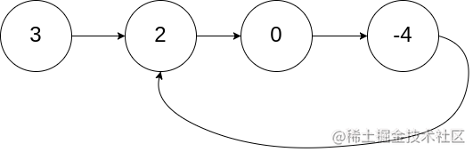
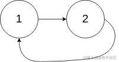
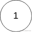

看一百遍美女，美女也不一定是你的。但你刷一百遍算法，知识就是你的了~~

谁能九层台，不用累土起!

[题目地址](https://leetcode-cn.com/problems/linked-list-cycle-lcci/)

<!-- more -->


## 题目

给定一个链表，如果它是有环链表，实现一个算法返回环路的`开头节点`。若环不存在，请返回 `null`。

如果链表中有某个节点，可以通过连续跟踪 `next` 指针再次到达，则链表中存在环。 为了表示给定链表中的环，我们使用整数 `pos` 来表示链表尾连接到链表中的位置（索引从 0 开始）。 如果 `pos` 是 `-1`，则在该链表中没有环。**注意：`pos` 不作为参数进行传递**，仅仅是为了标识链表的实际情况。

**示例 1：**




```
输入：head = [3,2,0,-4], pos = 1
输出：tail connects to node index 1
解释：链表中有一个环，其尾部连接到第二个节点。
```

**示例 2：**




```
输入：head = [1,2], pos = 0
输出：tail connects to node index 0
解释：链表中有一个环，其尾部连接到第一个节点。
```

**示例 3：**



```
输入： head = [1], pos = -1
输出： no cycle
解释： 链表中没有环。
```


## 解题思路

本题可与 [142_环形链表II](https://juejin.cn/post/7039700676150198308) 对比观看

- 我们可以定义两个指针一个快指针一个慢指针 快指针每次走2个节点 慢指针每次走一个节点
- 当快慢指针相遇时，第三个指针从head出发 每次一个节点
- 当第三个指针与慢指针相遇时，所在节点为题目要求的节点

## 解题代码

```js
var detectCycle = function(head) {
    if(!head) return null
    let slow = head
    let fast = head
    while(fast){
        slow = slow.next
        if(!fast.next) return null
        fast = fast.next.next
        if(fast==slow){
            let zz = head
            while(zz!=slow){
                slow = slow.next
                zz = zz.next
            }
            return zz
        }
        
    }
    return null
};
```

如有任何问题或建议，欢迎留言讨论！
