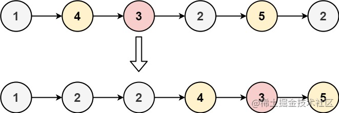

看一百遍美女，美女也不一定是你的。但你刷一百遍算法，知识就是你的了~~

谁能九层台，不用累土起!

[题目](https://leetcode-cn.com/problems/partition-list-lcci/)

<!-- more -->


## 题目

给你一个链表的头节点 `head` 和一个特定值 **`x` ，请你对链表进行分隔，使得所有 **小于** `x` 的节点都出现在 **大于或等于** `x` 的节点之前。

你不需要 **保留** 每个分区中各节点的初始相对位置。

**示例 1：**



```
输入： head = [1,4,3,2,5,2], x = 3
输出：[1,2,2,4,3,5]
```

**示例 2：**

```
输入： head = [2,1], x = 2
输出：[1,2]
```

**提示：**

-   链表中节点的数目在范围 `[0, 200]` 内
-   `-100 <= Node.val <= 100`
-   `-200 <= x <= 200`
      

## 解题思路

- 我们创建两个链表，一个用来存放小于`x`的节点，一个用来存储`>=x`的节点
- 遍历`head`，将对应的节点存入对应的链表
- 将小数链表的尾结点指向大数链表的头结点完成拼接
- 拼接后的链表就是我们题目要的链表


## 解题代码

```js
var partition = function(head, x) {
  let smallList = new ListNode()
  let bigList = new ListNode()
  let small = smallList
  let big = bigList
  while(head){
    let node = new ListNode(head.val)
    if(head.val<x){
      small.next = node
      small = small.next
    }else{
      big.next = node
      big = big.next
    }
    head =head.next
  }
  small.next = bigList.next
  return smallList.next
};
```
如有任何问题或建议，欢迎留言讨论！


