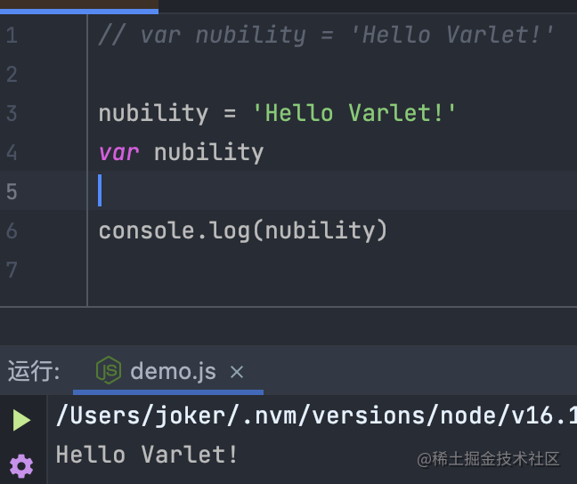
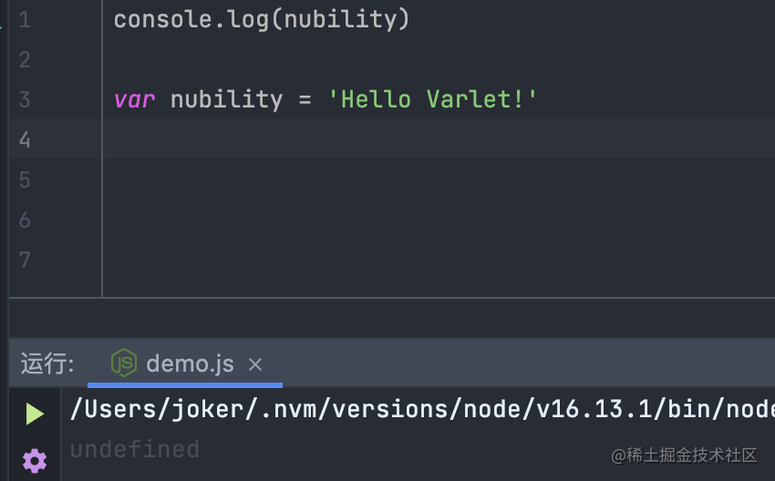
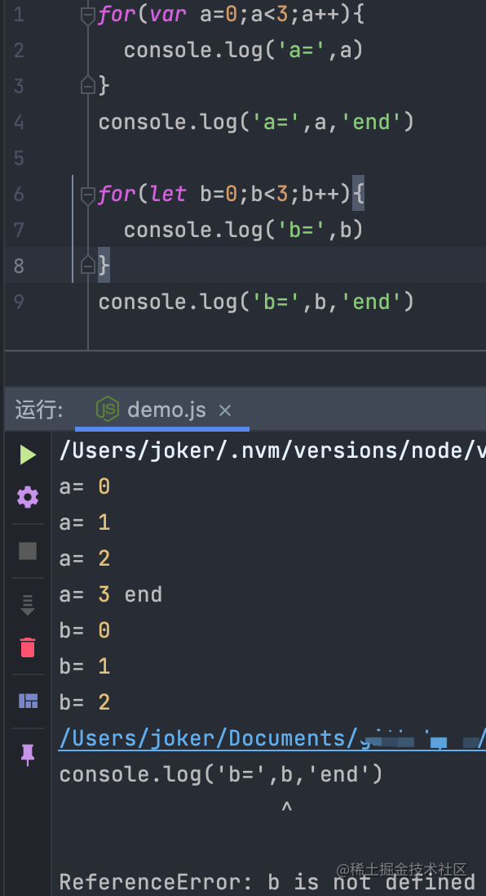

直到`ECMAScript5.1`，`var`都垄断了香火传参(声明变量)的这门差事，凭借其皇后(声明变量唯一关键字)的身份混的那是一个是风生水起啊。


不曾想从`ES6`之后，这天就变了，`let`和`const`成了各位老爷的新宠儿，自然而然地这`var`就搬进了冷宫。

> 本文将主要讲述`let`是如何一步一步地在声明变量领域 **'夺权'**


<!-- more -->


## 昔日皇后 var

在使用`var`声明变量时，变量会被自动的加到最近的上下文。

在函数中你那个，最接近函数的上下文就是函数的局部上下文。如果变量未经声明就被初始化，那么他会被添加到全局上下文中。

举个🌰

```js
function add (){
  var sum = 1
  return sum
}
var res = add()
console.log(res) // 1
console.log(sum) // ReferenceError: sum is not defined
```
因为我们将`sum`定义在`add`中，`sum`就成了`add`的局部变量，所以我们在函数外部就访问不到了。

我们让`var`娘娘暂作歇息(省略)，再看一下

```js
function add (){
  sum = 1
  return sum
}
var res = add()
console.log(res) // 1
console.log(sum) // 1
```


我们可以看到，`add`被调用后，`sum`被添加到了全局上下文，即使`add`函数退出了，`sum`依旧可以被访问到。

**注意**:在严格模式下，未经声明就初始化变量会报错。因为，各位老爷要养成先声明变量再初始化的习惯哦。


另外，我们需要注意一下，`var`声明的变量会被拿到函数作用域或全局作用域的顶部，也就是作用域所有代码的最前面(毕竟身份摆在那),也就是常说的 **变量提升**。

这会导致很多合法但是奇怪的现象，我们看个🌰






通过变量提升我们会拿到未被初始化的`undefined`而不是`ReferenceError`


## 老爷们的新宠儿let

`let`的出现，像是一阵清流，改变了这个现状。她与`var`功能是那般相似，但是又比`var`更通情达理。可以让我们将变量绑定到所在的任意块级作用域中。

这意味着，我们跟`let`相处时会更加的轻松(只需要一对{...}就可以创建一个作用域)


我们回过头来再看一下变量提升的🌰

```js
console.log(a) // undefined

console.log(b) // ReferenceError: Cannot access 'b' before initialization

var a

let b
```

其实也很好理解，娘娘(`var`)么跑在前面是应该的，你个新来的妃子(`let`)凭证得到老爷们喜欢就跑前面去就有点没摆正自己位置了，必然得发宗人府去(`ReferenceError`)了


有了这个解释相信这个🌰也会变得很好理解

```
if(true){
  var a = 1
  let b = 2
}
console.log(a) // 1
console.log(b) // ReferenceError: b is not defined
```

娘娘(`var`)只要在皇宫里(函数上下文内)都是没问题的，妃子(`let`)只能在自己的寝宫里(块级作用域内)

从这个🌰中我们可以看出，`let`的行为非常适合在循环中声明迭代变量。使用`var`声明的迭代变量会泄漏到循环外部。



`for`循环头部的`let b`不仅为循环本身声明了一个`b`，而是为循环的每一次迭代都更新声明了一个新的`b`。这意味着`loop`迭代内部创建的闭包封闭是每次迭代中的变量，也正如我们的期望一样。

而`var`在外层作用域中只有一个`a`，这个`a`被封闭进去，而不是每次迭代都会有一个新的`a`。因此最后我们输出的i也正是外层作用域中的`a`。


## 最后

`let`固然得到不少老爷们的喜爱，`var`相信也有老爷对其恋恋不忘藕断丝连。

但是我就不一样了，小孩子才做我选择，我全都要！！！！

于是`varlet`就来了~~

[`varlet`](https://github.com/varletjs/varlet)是一个基于 `Vue3` 开发的 Material 风格移动端组件库，欢迎小伙伴们`star`&&`pr`


