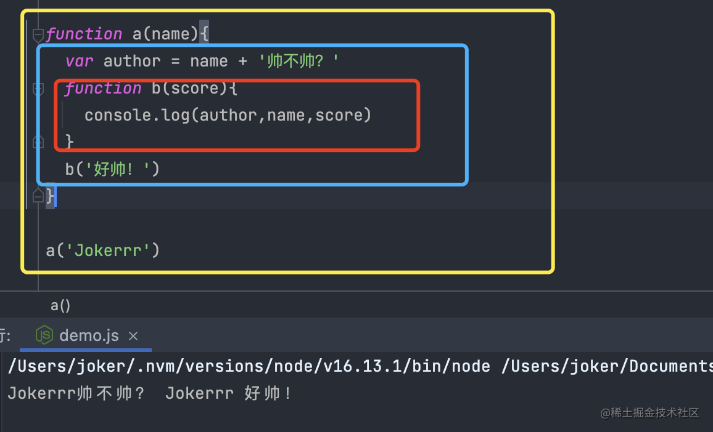
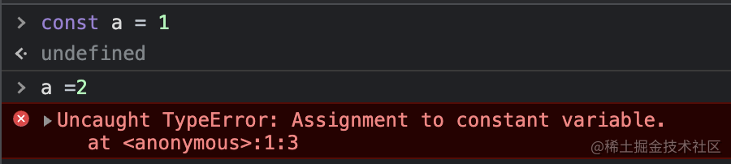

## 作用域是啥

作用域几乎是最基本的功能了，可以用来存储变量，方便我们之后对这些变量进行访问或修改。


<!-- more -->


我们举个简单的栗子🌰来方便理解：

```js
var nubility = 'Hello Varlet!'
```

我们来解析一下浏览器拿到这串代码后做的事情

- 编译器会查看作用域中是否已经存在一个`nubility`。如果有了，那么编译器会忽略`var`声明继续进行编译；否则将会要求作用域声明一个变量`nubility`

- 接下来编译器会生成用来处理`nubility = 'Hello Varlet!'`赋值操作的代码并交给引擎

- 引擎拿到代码后会先询问作用域中是否存在`nubility`这个变量。如果有，那么引擎就会用这个变量，否则则会继续上上一层作用域中继续查找该变量

- 如果作用域中找到了`nubility`这个变量，那么就会`'Hello Varlet!'`赋值给它，否则引擎将会抛出一个异常

```
VM418:1 Uncaught ReferenceError: nubility is not defined
```

## 词法作用域

我们先介绍一下词法作用域这个命名的来历。

编译器拿到我们编写的源代码后先将代码进行词法化，这个过程中会对源代码中的字符进行检查，如果是有状态的解析过程则会赋予单词语义。(也成为静态作用域)

> 一句话总结：词法作用域就是定义在词法阶段的作用域。

语义化就是，在我们编写代码时由我们的变量和块级作用域写在哪里决定的。

举个🌰



- 黄色的框包含全局并且只有一个标识符`a`

- 蓝色的框为`a`创建的作用域，包含三个标识符`name`、`b`、`author`

- 红色部分包含`b`创建的作用域，其中只有一个`score`标识符

从这边我们可以看出这些对应的框由其作用域块代码的边写决定的，向下层逐级包含。

作用域的结构以及互相之间的位置关系可以给引擎提供用于查找标识符的位置信息。

我们一起来解析一下上面的代码

- 引擎在执行`console.log(author,name,score)`时会查找`author,name,score`这三个变量的引用

- 先在`b`的作用域中查找，引擎在这里无法找到`author,name`,所以会向上一级`a`的作用域中继续查找

- 在`a`的作用域中，引擎找到了`author`和`name`，就使用了这里的引用

> 总结一下：作用域查找会在找到第一个匹配的标识符时停止查找

在多级嵌套的作用域中，可以定义同名标识符，作用域的查找从运行时所在的最内层向外查找，找到第一个匹配的标识符为止。

⚠️⚠️⚠️⚠️⚠️⚠️

其实这也不是绝对的


😳😳😳可恶啊居然还有？先摆个烂歇会~


ok，时间到😋摆烂结束。接下来我们聊聊欺骗词法

js中有两种机制可以在运行时修改词法作用域，一个是`eval`另一个是`with`。社区中普遍认为这种机制会导致性能下降，因此我们不做过多介绍，本篇中仅以`eval`为例进行分析。

先介绍一下`eval`的功能：可以接收一个字符串作为参数，并将其中的内容作为书写在程序该位置的代码。

举个🌰：

```js
function a(str){
  eval(str)
  console.log(num)
}
var num = 1

a('var num = 2')
```

`eval`调用中的`var num = 2`，会被当做在`a`的作用域中来处理，对`a`的词法作用域进行了修改，从而遮蔽了外部的同名变量`num`，因此引擎在执行`console.log`时只会在`a`内部找到这个`num`.


## 函数作用域

函数作用域是指：属于这个函数的全部变量都可以在整个函数的的范围内使用以及复用(包括嵌套的子作用域)。

在软件设计中，我们遵循最小暴露原则。也就是说我们可以使用内嵌作用域来对一些变量和函数进行私有化，从而避免污染全局。

举个🌰


```js
function a(num){
  b = num + c(num)
  console.log(b)
}

var b

function c(num){
  return 2*num
}

a(2)
```
在这个例子中，变量`b`和函数`c`都应该是实现`a`具体操作的私有内容，放在全局的话可能会被有意或无意的被修改成非预期的方式，因此更合理的方式是将`b`和`c`隐藏咋函数`a`的内部.

```js
function a(num){
  var b

  function c(num){
    return 2*num
  }

  b = num + c(num)
  console.log(b)
}

a(2)
```

## 块级作用域

块级作用域是用来最小暴露原则进行拓展的工具，将代码从在函数内隐藏信息拓展为在块内隐藏信息。

举一个常见的例子

```js
for(var i = 0;i<996;i++){
    console.log(i)
}
```

`i`其实只在`for`的循环内部使用，但是却污染到了整个函数作用域中，我们如果使用块级作用域可以使其只能在`for`的循环内部使用，这对保证变量不会被混乱的复用，以及提升代码的可维护性有很大的益处。

### try/catch

`ES3`规范中`try/catch`的`catch`分句会创建一个块级作用域，其中声明的变量只在`catch`生效

```js
try{
    undefined() //随便执行一个能让他出错的
}
catch(e){
    console.log(e) //能正常执行
}

console.log(e) //VM20919:8 Uncaught ReferenceError: e is not defined
```

### let

ES6中提供了`let`关键字，可以将变量绑定到任意的作用域,通常是定义改变量所在的`{...}`中。

也就是说，`let`关键字可以为其声明的变量隐式创建块作用域。

### const 

除了`let`以外ES6还引入了`const`，同样可以用来创建块作用域变量，但其值时固定的。之后任何修改值的操作都会抛出错误。




## 最后

以上就是本人对于作用域的一些见解，如有任何问题或建议，欢迎留言讨论！

顺便推荐一下本人参与的开源项目 [varlet](https://github.com/varletjs/varlet) 欢迎大家star pr


